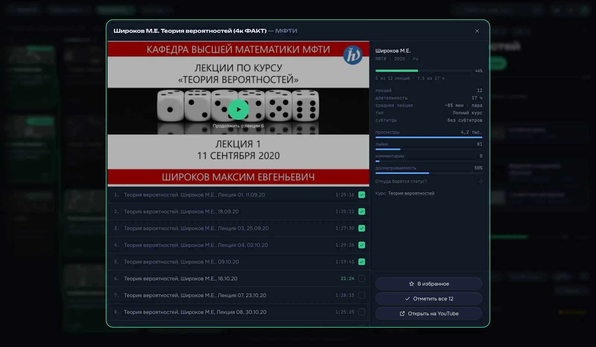
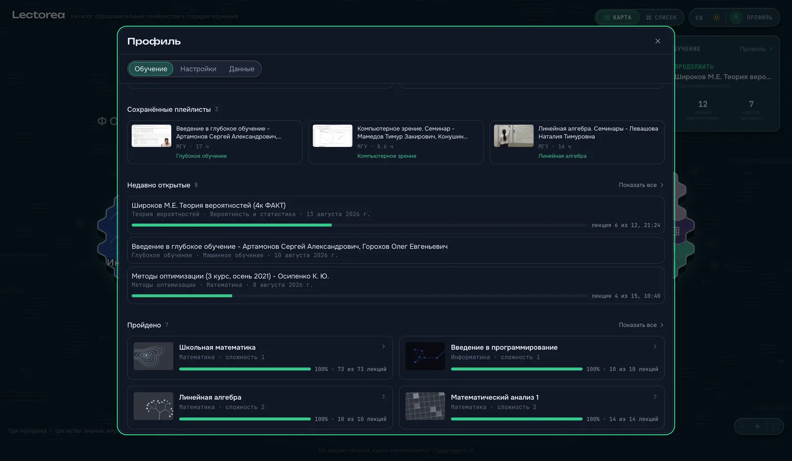
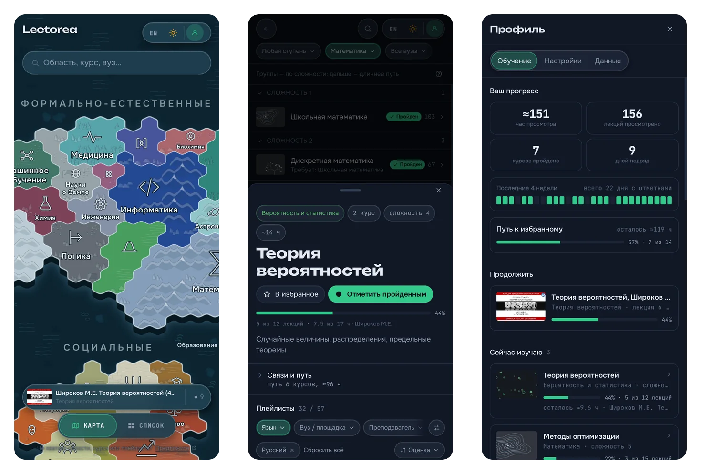

# Lectorea

> **What to learn, and in what order.** A free catalogue of university lecture
> courses on YouTube, arranged by what has to come first: every course shows
> what you need before it and what it opens up after, so a subject becomes a
> route rather than a pile of links.

**[🇷🇺 Читать по-русски](README.ru.md)** ·
**[Open the catalogue →](https://lectorea.org/)**

236 courses across 39 fields of knowledge, each one knowing what it depends on,
and some 12 500 recordings of them from 309 universities and channels. That
is the difference from a search engine: YouTube can find you a lecture on tensor
analysis, but it cannot tell you that you will not understand it without linear
algebra. Lectorea answers the two questions that actually come up:

- **What do I need to know before this course?**
- **What can I study right now, with what I already know?**

No registration, no ads, nothing to pay for. Everything you mark stays in your
browser — and if you want it on your phone as well, one optional sign-in
carries it there and nothing else changes. The catalogue re-crawls itself every
night. The interface is Russian and English, and so is the catalogue — about
seven recordings in ten are in English.

## Who it is for

**If you are teaching yourself.** You know where you want to end up — machine
learning, quantum mechanics, ancient philosophy — but not what the road there
looks like. Mark a course as your goal and the site lays out the path to it:
every prerequisite in the right order, with an estimate in hours and video
lectures for each step. You get a curriculum instead of a folder of bookmarks.

**If you are a student with an exam coming.** Your lecturer's recording is not
the only one that exists. Find the same course here and you get every recording
of it — several universities, several lecturers — sorted by rating rather than
by view count. Filter down to a language, a lecture length or a course with
subtitles, and if one explanation does not land, take the next.

**If you have just finished something and want to know what is next.** Every
course shows what it opens up: the courses that become reachable once this one
is done. That turns "I have learned probability theory, now what?" into a list
of concrete answers rather than a search query.

**If you are filling in gaps.** Walk the path to a course you thought you
already knew, and the columns to the left of it are exactly what you may have
missed.

## How to use it

1. **Start on the map.** Three continents — formal and natural sciences, social
   sciences, humanities — with the fields of knowledge drawn as territories. The
   bigger the territory, the more courses it holds. Move it as you would any
   map: two fingers to carry it, a pinch to go in — the names grow a little as
   you do, and more of them appear. Or just search: the box understands
   abbreviations and student slang, so `теорвер` and `линал` find what you mean.
2. **Pick a field and read the columns.** Each column is a difficulty level:
   the number of courses that have to come before this one. Left is the
   foundation, right is what stands on it. Hovering over a card lights up what
   it needs.
3. **Open a course.** You get its prerequisites and what it leads to, the full
   path to it in order, and the recordings themselves — filterable by language,
   university, lecturer, lecture length, subtitles, year and completeness.

   

4. **Watch, and it keeps count.** Play a lecture in the built-in player and it
   remembers the second you stopped at; anything watched on YouTube gets a tick
   of its own. A course moves through *not started → in progress → done* on its
   own from that — and the button that cycles it by hand is still there, which
   is what makes "what can I study right now" answerable.

   Pressing play gives the player its own screen: a large picture, the lectures
   beside it as a queue, and under the frame the lecture you are on, how far
   into it you are, the way to the next one and a button to mark it off — so a
   whole course can be worked through without ever opening YouTube.

   There is a pomodoro in that strip too, set to whatever lengths you study in.
   When the session runs out it pauses the lecture and puts the rest on the
   screen; when the rest runs out it chimes, and the lecture starts again on the
   same press that starts the next session.

   

## What is in it

**A path, not a list.** Any course can be turned into a study plan: every
prerequisite in order, an estimate in hours, and a running count of how much of
it you have already done. Export the plan and it downloads as a Markdown
checklist with links, ready for your notes app.

**Recordings ranked honestly.** The default sort is not view count but how
strongly people reacted — likes and comments per view — corrected so that a
playlist with forty views and one enthusiastic comment cannot outrank MIT. A
careful lecture course from a small university gets a fair hearing. Playlists
that have died or been half-deleted are dropped automatically.

**Progress, down to the lecture.** A lecture counts as watched at 90% of its
length, or when the player says it ended; anything watched on YouTube instead
gets a tick of its own, shift-click marks a run of them, and one press seals a
whole playlist. A playlist is the share of its lectures behind you, a course is
the recording it is being studied by — never the sum of thirteen alternatives.
Watching promotes a course on its own, and pressing the status button yourself
takes the wheel back.
See [docs/interface.md](docs/interface.md#progress-down-to-the-lecture).

## What the profile holds

There is no account and nothing to sign up for — the profile is a modal over
whatever you were looking at, and it reads top to bottom as the routine it
describes.

- **The numbers.** Hours watched, lectures behind you, courses finished, days in
  a row — then the last four weeks as a strip of days, and the path to
  everything you marked as a goal, as one bar with the hours still to spend.
- **Продолжить.** The last thing you opened that is not finished, at the lecture
  and the second you left it at, one press away.
- **The shelves.** What you are studying now, your goals, the playlists you
  saved, what you had open lately, what is behind you. Each shows a handful and
  opens into the whole of itself without leaving the profile.

**Goals.** A favourite course is a goal: its card counts the whole path to it,
not the course alone, so the bar moves while you are still three prerequisites
away.

**The front page remembers you.** Come back and the map carries the lecture you
stopped at and the three numbers that say whether the habit is alive — days in a
row, lectures watched, courses done. One press to carry on, one to open the
profile.

**Your data is yours.** Everything lives in your browser, and there is no server
to hold it. The **Данные** tab exports it all as one JSON file and imports it
back on another machine — replacing what is there or merging it, keeping the
further-along status on a conflict, and taking the union of the days you
studied. That is today's whole sync story; the [roadmap](docs/roadmap.md) is
about making it less manual.

The site does count how it is used — which courses get opened, and above all
which searches come back empty, because a search with no results is a course
the catalogue is missing and there is no other way to hear about one. It counts
nothing about *you*: no account, no identifier, no advertising data, and nothing
you typed beyond a search term that has been through a filter. Your profile is
never sent anywhere. **Профиль → Настройки** has a switch that turns the whole
of it off, and the rules are written out in full in
[docs/analytics.md](docs/analytics.md).

## On a phone

Not a shrunk desktop. The map is drawn a second time with the continents stacked
into a column, because three of them ranged side by side on an upright screen is
a strip of land in a lot of water — and it opens close in rather than on the
whole world, since a whole world on a phone is names at four pixels. The columns
become a list you can fold by difficulty, a course opens as a sheet you drag up
for the whole card, search takes the whole screen, and the map/list switch sits
under your thumb instead of in the far corner.

**It installs.** The site is a PWA: add it to the home screen and it opens in its
own window, and everything you have already looked at works without a
connection.

## The catalogue keeps itself fresh

Nobody has to press anything for the site to stay current. Every night a job
re-reads the recordings it already knows — titles, lecture lists, durations,
view and like counts, subscriber counts — and checks that they are still there.
A playlist that has been deleted or half-emptied drops out of the ranking on its
own; a course that has quietly lost all of its recordings stops being shown, and
comes back the day one matches it again. New matches between a playlist and a
course are the one thing that does not publish itself: they arrive as a pull
request for a human to look at, because a wrong binding is a course nobody looks
at twice. When the crawl finishes, the site rebuilds and deploys itself.

The details, the quota arithmetic and what happens when a night fails —
[docs/pipeline.md](docs/pipeline.md#automation).

## Small comforts

Light and dark themes, a Russian and an English interface (course titles stay in
the language the catalogue is written in), a link that carries the exact view you
are looking at, and keyboard shortcuts (`/` search, `t` theme, `m` swap the map
and the columns, `?` for the rest).

## Where it is going

Sync between devices, progress that survives a cleared browser, a path with
dates in it, and search inside the lectures — with what is deliberately *not*
planned written down beside it: **[docs/roadmap.md](docs/roadmap.md)**.

## The catalogue is public — help fix it

Everything you see is open data, and anyone can change it. If a course is
missing its best recording, or a prerequisite is wrong, or a whole subject is
absent, say so:

- **«Предложить плейлист»** on a course with nothing in it opens a ready-made
  form. It asks for one thing — the link. The university, the lecturer, the
  language and the running time are read from YouTube automatically.
- **«Исправить данные»** in a course panel opens the exact file the course comes
  from.
- Or open an issue [here](https://github.com/fivol/lectorea/issues/new/choose) —
  there are four short forms: a playlist, a course, a field of knowledge, and
  everything else.

A course with no recordings is kept in the data and dropped from the site rather
than deleted: the markup is right, the graph is right, and the day a playlist
matches it the course comes back. The exception is a course something visible
depends on — that one stays, empty or not, because a gap in a chain of
prerequisites is a worse answer than a card with nothing behind it.

---

Building it, running it locally, the data model and the pipeline behind it —
[docs/README.md](docs/README.md).
