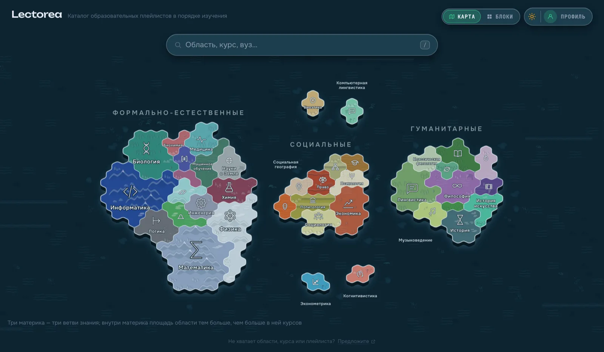
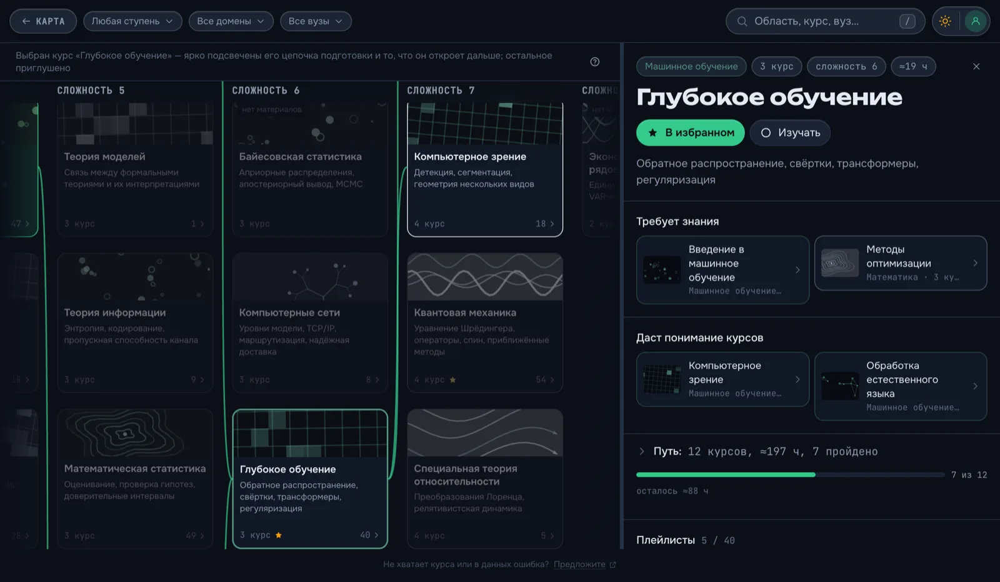
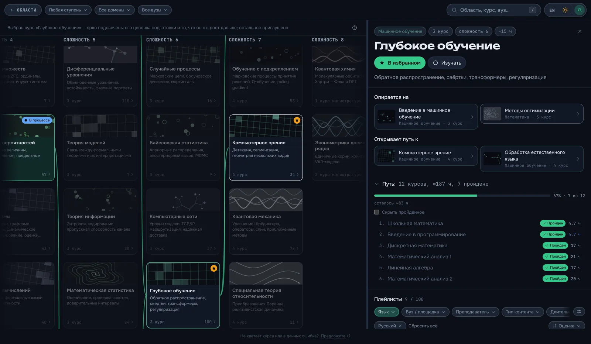
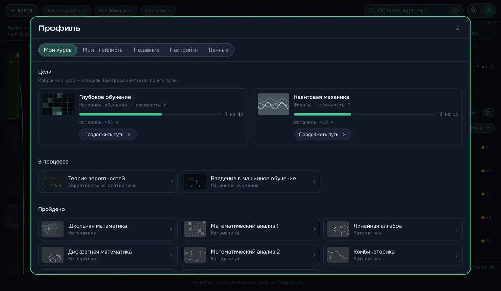

# Lectorea

> **Что учить и в каком порядке.** Бесплатный каталог университетских
> видеокурсов с YouTube, разложенный по тому, что чему предшествует: у каждого
> курса видно, что нужно знать до него и что открывается после, — и предмет
> превращается в маршрут вместо кучи ссылок.

**[🇬🇧 In English](README.md)** ·
**[Открыть каталог →](https://fivol.github.io/lectorea/)**

Почти 200 курсов в 39 областях знания, и каждый знает, на что он опирается. Этим
каталог и отличается от поиска: YouTube найдёт лекцию по тензорному анализу, но
не скажет, что без линейной алгебры её слушать бесполезно. Lectorea отвечает на
два вопроса, которые возникают на самом деле:

- **Что нужно знать до этого курса?**
- **Что я могу изучать прямо сейчас с тем, что уже знаю?**

Без регистрации, без рекламы и без платных подписок. Всё, что вы отметите,
остаётся в вашем браузере.

## Кому это нужно

**Если вы учитесь сами.** Понятно, куда хочется прийти — машинное обучение,
квантовая механика, античная философия, — но не понятно, из чего состоит дорога.
Отметьте курс целью, и сайт выстроит путь: все предпосылки по порядку, оценка в
часах и видеолекции на каждый шаг. Вместо папки с закладками получается учебный
план.

**Если вы студент и скоро сессия.** Запись вашего лектора — не единственная. Тот
же курс в каталоге открывает все его записи: несколько вузов, несколько
лекторов, отсортированные по рейтингу, а не по числу просмотров. Отфильтруйте по
языку, длине лекции или наличию субтитров — и если одно объяснение не заходит,
возьмите следующее.

**Если вы что-то закончили и не знаете, что дальше.** У каждого курса показано,
что он открывает: курсы, которые становятся доступны после него. «Прошёл
теорвер, что теперь?» превращается в список конкретных ответов, а не в ещё один
поисковый запрос.

**Если вы закрываете пробелы.** Пройдите путь к курсу, который вроде бы уже
знаете, — колонки слева от него и есть то, что могло пройти мимо.

## Как пользоваться

1. **Начните с карты.** Три материка — формально-естественные, социальные,
   гуманитарные науки, — а области знания нарисованы на них странами. Чем больше
   в области курсов, тем больше её территория. Или сразу ищите: поиск понимает
   сокращения и студенческий сленг, так что `теорвер` и `линал` находят то, что
   нужно.
2. **Выберите область и читайте колонки.** Колонка — это сложность: сколько
   курсов должно идти до этого. Слева фундамент, справа то, что на нём стоит.
   Наведите курсор на карточку — подсветится всё, что она требует.
3. **Откройте курс.** Здесь его предпосылки и то, к чему он ведёт, полный путь
   по порядку и сами записи — с фильтрами по языку, вузу, лектору, длине лекции,
   субтитрам, году и полноте курса.

   

4. **Отмечайте, что делаете.** Курс переключается между *не начат → в процессе →
   пройден*, и именно это делает вопрос «что я могу изучать сейчас»
   отвечаемым.

## Что внутри

**Путь, а не список.** Любой курс разворачивается в план: все предпосылки по
порядку, оценка в часах и счётчик того, сколько уже пройдено. План выгружается
markdown-чеклистом со ссылками — можно сразу положить в заметки.

**Честный рейтинг записей.** По умолчанию сортировка не по просмотрам, а по
тому, насколько живо на курс реагировали, — лайки и комментарии на просмотр, с
поправкой, чтобы плейлист с сорока просмотрами и одним восторженным
комментарием не обгонял MIT. У аккуратного курса небольшого вуза появляется
шанс. Умершие и наполовину удалённые плейлисты отсеиваются автоматически.

**Цели и прогресс.** Добавьте курс в избранное — он станет целью: в профиле
появится прогресс по всему его пути, сколько часов осталось и кнопка к
следующему курсу, за который реально можно взяться.

**Отметки, плейлисты, история.** Курсы в процессе и пройденные, избранные
плейлисты и всё, что вы недавно открывали, — с группировкой по курсу или по
вузу.

**Данные ваши.** Ни аккаунта, ни сервера: всё живёт в браузере. Вкладка
**Данные** выгружает профиль одним JSON-файлом и загружает его обратно на другой
машине — заменой или объединением, и при конфликте побеждает более продвинутый
статус. Это вся синхронизация, и она работает между браузерами без чьего-либо
сервера.

**Мелочи, которые приятны.** Светлая и тёмная темы, русский и английский
интерфейс (названия курсов остаются на языке каталога), ссылка, которая
переносит ровно тот вид, что вы видите, и горячие клавиши (`/` — поиск, `t` —
тема, `?` — весь список).

## Каталог общий — его можно править

Всё, что вы видите, — открытые данные, и менять их может кто угодно. Если у
курса нет лучшей записи, предпосылка выглядит неправильной или целого предмета
не хватает — скажите об этом:

- **«Предложить плейлист»** у пустого курса открывает готовую форму. В ней одно
  поле — ссылка. Вуз, лектор, язык и продолжительность подтягиваются с YouTube
  сами.
- **«Исправить данные»** в панели курса открывает тот самый файл, из которого он
  взят.
- Или заведите
  [issue](https://github.com/fivol/lectorea/issues/new/choose) — там четыре
  короткие формы: плейлист, курс, область знания и всё остальное.

Пустые курсы нарочно видны, а не спрятаны: они показывают, где в каталоге дырки,
и незаселённые окраины карты — это приглашение.

---

Как всё устроено, как запустить локально, модель данных и пайплайн —
[docs/README.md](docs/README.md).
