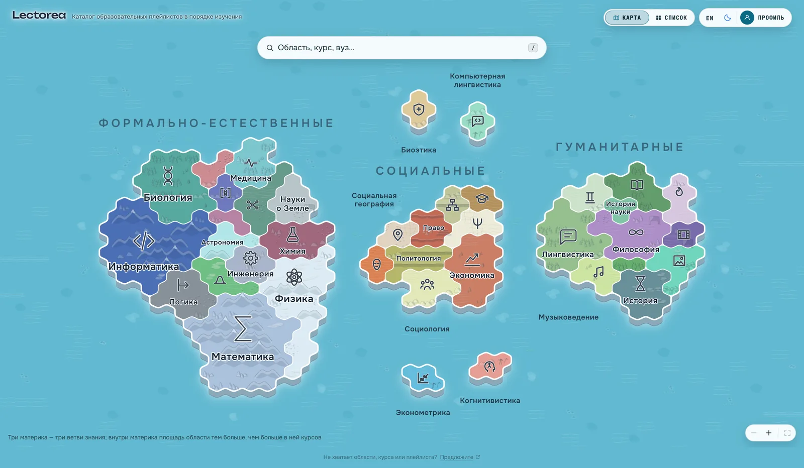

# The design system

[← docs](README.md) · [interface.md](interface.md) for what the screens do

One palette, two themes — the same route, repainted by the same variables:

| Dark | Light |
|---|---|
|  |  |

Every colour, size, radius, shadow and duration in the product is named once, in
`src/index.css`, and referenced by name everywhere else. Components never carry
a raw value.

The names are read in two places: `tailwind.config.js` maps them onto utility
classes (`bg-surface`, `text-ink-dim`, `duration-base`, `rounded-card`), and a
handful of places read the variables directly where a class cannot reach — an
SVG stroke, a `color-mix`, an inline style computed from data.

That indirection is not decoration. The map screen repaints the entire palette
for one route by overriding the same variables on a wrapper (`MAP_SURFACE_VARS`
in `src/screens/Map/MapView.tsx`), and every button, field and legend on it
keeps working without knowing the map is underneath. Only one set of names can
support that.

## Colour

Dark is the primary mode. The graph is looked at for a long time, and a light
canvas with a hundred cards on it is tiring; light mode is honest but second.

| Token | Tailwind | Light | Dark | Used for |
|---|---|---|---|---|
| `--c-canvas` | `canvas` | `#F6F8FB` | `#0B0F17` | the page |
| `--c-surface` | `surface` | `#FFFFFF` | `#111726` | cards, panels, modals |
| `--c-surface-2` | `surface-2` | `#EEF2F7` | `#1A2233` | nested surfaces: fields, chips, row hover |
| `--c-overlay` | `overlay` | `rgb(15 23 42 / .45)` | `rgb(0 0 0 / .6)` | behind a modal |
| `--c-line` | `line` | `#E2E8F0` | `#243044` | borders, dividers |
| `--c-line-strong` | `line-strong` | `#CBD5E1` | `#334155` | a control under the pointer |
| `--c-ink` | `ink` | `#1E293B` | `#E6EBF2` | headings and body |
| `--c-ink-dim` | `ink-dim` | `#64748B` | `#8B98AC` | descriptions, metadata |
| `--c-ink-faint` | `ink-faint` | `#94A3B8` | `#5B6B82` | placeholders, disabled |

Colour is never decoration. It means one of five things:

| Token | Tailwind | Light | Dark | Meaning |
|---|---|---|---|---|
| `--c-formal` | `formal` | `#3B82F6` | `#60A5FA` | the formal and natural continent |
| `--c-social` | `social` | `#EA8A3C` | `#F0A35E` | the social continent |
| `--c-humanities` | `humanities` | `#9B5DE0` | `#B583EA` | the humanities continent |
| `--c-accent` | `accent` | `#22A06B` | `#34C98A` | selection, progress, success |
| `--c-warning` | `warning` | `#D97706` | `#F59E0B` | middling quality, a favourite star |
| `--c-danger` | `danger` | `#DC2626` | `#F87171` | destructive |

Each continent also has a `-soft` wash — `--c-accent-soft`, `--c-formal-soft`
and so on — for a card that is *in* something rather than *selected*. In light
these are pale tints; in dark they are the accent at low alpha, because a mixed
pastel over a near-black surface turns to mud.

Any token also takes an opacity modifier: `bg-accent/10` for a fill that has to
let the row under it through, `border-danger/40` for a rim that is a warning
rather than an alarm. That works because every colour is declared through
`themed()` in `tailwind.config.js`, which hands Tailwind a function and writes
the alpha out as `color-mix`. It is worth knowing that this had to be arranged:
a bare `var(--c-…)` is a value Tailwind cannot parse, and `bg-accent/60` used to
compile to no declaration whatsoever — see
[pitfalls](agents/pitfalls.md#interface-and-styling). The `-soft` tokens stay
for what they are for, a wash whose weight differs by theme; the modifier is for
one place needing one strength.

Colour is never the only carrier. Quality is a coloured dot **and** a number,
a continent is named by its heading, and a card in the selected chain has a
border and a position in the path list as well as a wash.

### The domain hues

Each field's colour comes with its biome — `shared/tiles/biomes.ts`, and
[docs/biomes.md](biomes.md) for why the ground a territory is made of and the
colour it is painted are one line. `data/domains.yaml` holds no colours; the
loader fills them in, so `domain.color` still works everywhere it used to.

Those colours are picked to be *territories*: large shapes with a border round
them, grouped by continent and spread far enough apart that no two neighbours on
the map read alike. A
biome ramp therefore reaches both ends of the range that fails as text — dark
basalt dies on the night canvas, pale chalk on the day one. So anything that
prints a domain colour as *text* runs it through `inkOn()`
(`src/lib/format.ts`), which lifts or deepens the hue until it clears 4.5:1 on
the scheme it is printed on, without introducing a second palette to keep in
step. Shapes — the stripe on a card, a territory, a glyph — use the raw hue,
where 3:1 is the bar.

## Type

| Tailwind | Size / leading | Weight | Used for |
|---|---|---|---|
| `text-h1` | 28 / 34 | 700 | the course name in the panel, a modal title |
| `text-h2` | 22 / 28 | 700 | continent headings |
| `text-h3` | 16 / 22 | 600 | card titles |
| `text-body` | 14 / 21 | 400 | descriptions |
| `text-caption` | 13 / 18 | 400 | secondary lines, tooltips |
| `text-mono` | 13 / 18 | 500 | numeric metadata |
| `text-mono-label` | 12 / 16, +.06em, uppercase | 600 | «СЛОЖНОСТЬ 4», group headings |

Three families: **Unbounded** for display (`font-display`, and `h1`/`h2` get it
automatically), **Onest** for text, **JetBrains Mono** for anything numeric.

Every number goes mono. Counts, difficulty, hours, timings, playlist metadata —
`.num` sets the family and tabular figures together, so a digit changing does
not shift the ones beside it. `.mono-label` is the small uppercase variant.

## Space, radius, depth

Spacing is Tailwind's scale (`1` = 4px); the set the design uses is
`4 / 8 / 12 / 16 / 20 / 24 / 32 / 48`, mirrored as `--space-1…8` for the rare
raw value. Card padding is 16, the course panel 20, modals 24.

| Token | Tailwind | Value | Used on |
|---|---|---|---|
| `--radius-sm` | `rounded-chip` | 8px | chips, inputs, buttons |
| `--radius-md` | `rounded-card` | 12px | cards, playlist rows |
| `--radius-lg` | `rounded-pop` | 16px | panels, modals, popovers |

Shadows are a light-mode device: `--shadow-card`, `--shadow-pop` (dropdowns,
tooltips, the floating search field) and `--shadow-modal`. In dark, depth comes
from `--c-surface` against `--c-surface-2` and from borders instead —
`--shadow-card` is `none` there, and only the modal and the portalled popover
keep one, because a popover lands on whatever happens to be beneath it and a
border alone will not lift it off.

### The plate

Every control — a button, a chip, a field, a switch — is a capsule cut from one
material, and the material has its own four tokens:

| Token | Light | Dark | Dark, over the map |
|---|---|---|---|
| `--plate-bg` | `rgb(255 255 255 / .94)` | `rgb(28 37 53 / .94)` | `rgb(30 63 79 / .94)` |
| `--plate-line` | `rgb(15 23 42 / .14)` | `rgb(255 255 255 / .16)` | `rgb(230 243 249 / .26)` |
| `--plate-rim` | `rgb(255 255 255 / .9)` | `rgb(255 255 255 / .08)` | `rgb(255 255 255 / .12)` |
| `--plate-shadow` | `0 2px 8px …` | `0 2px 12px …` | `0 6px 18px …` |

One rule holds it together: **the plate is always lighter than what it lies
on.** A control darker than its page is a hole, not a thing you press — and the
night sea is lighter than every surface in the dark palette, which is why the
map overrides the fill again with the colour of land. The rim of light along the
top edge and the shadow under it are the same two devices the continents use to
sit on the water.

Capsules, not rounded rectangles: the map is drawn out of round shapes, and
`rounded-chip` in the middle of it reads as a piece of some other product. Only
what holds more than a line keeps a corner — cards, panels, the import textarea.

The chrome is set in the map's own lettering, mono and spaced caps
(«КАРТА · БЛОКИ · ПРОФИЛЬ»), so a control steering the catalogue never reads as
a word inside it. The chosen half of a switch, an active filter and the current
tab are all the same accent inlay: a 24% wash with a 60% ring.

### Derived, where a named colour cannot follow

The palette names one colour per job, and every name is measured against
`--c-surface` — which is right until the thing wearing it floats somewhere else.
The front-page card is a plate over the map, and inside it: `border-line` is a
slate hairline on teal land, so the three counts read as numbers loose in the
corner; `--c-surface-2` as a hover fill is a slate slab dropped into the plate;
`--c-ink-faint` under a number lands near 2:1, which is a caption that is
technically present. All three were correct on the page and wrong on the map,
and no fourth token fixes it — the ground is a variable.

So three materials are **mixed from whatever ink is in force** rather than named:

| Class | What it is | Where |
|---|---|---|
| `.inlay` | a box standing on its ground: 7% ink fill, 10% ink edge, `--radius-md` | `FactTile`, the front-page counts, the resume block in the panel |
| `.inlay-hover` | the same material arriving under the pointer instead of resting there | rows that travel — the resume card, the phone bar |
| `.ink-soft` | 72% of the ink: a caption that has to be **read** | the word under a number, a metric's name |

They work over the map for free, because the map restates `--c-ink` along with
everything else and a mix follows it without being told. The rule of thumb:
`--c-ink-faint` is for what a reader is meant to skip — placeholders, disabled
controls, decoration. The word under a number is not one of those; «дня подряд»
is what makes the 3 mean anything, so it is `.ink-soft`.

`hover:bg-surface-2` is still the right answer for a row that only ever sits on
a surface — a lecture in the player, a playlist in the list. It is the ones that
travel that need the mix.

**There is no focus ring.** `:focus-visible` is set to `outline: none` in the
base layer, and that is a deliberate departure from the usual advice.

It used to be `2px solid var(--c-accent)` at a 2px offset on everything
interactive, cards included. What settled it is that the browser, not the
design, decides when `:focus-visible` matches: a press with the mouse leaves
nothing, but the next key stroke of any kind — a space to scroll the panel is
enough — lights up whatever was pressed last and leaves it lit, with no gesture
that puts it away. A reader who has never touched Tab ends up with a green
rectangle around a fold they opened a minute ago.

What is given up with it is real: somebody working the keyboard now has to read
their position off the hover styling, and not every control has one. Restoring
it is one rule in `src/index.css` — the block is still there, with `none` where
the outline was.

Two focus signals are kept, because neither is a rectangle drawn round a
control. A text field takes the accent on `:focus-within`, which belongs to the
capsule and marks where typing goes; a map territory takes the accent on its own
outline (`.map-territory:focus-visible .territory-edge`), because its shape is
not a box and a bounding rectangle would point at open sea.

## Motion

Two durations do most of the work, three easings shape them.

```css
--dur-fast: 140ms;   /* hovers, small state changes */
--dur-base: 220ms;   /* panels, dropdowns, dimming */
--dur-slow: 320ms;   /* modals, theme change */
--ease-out:   cubic-bezier(0.16, 1, 0.3, 1);   /* entering */
--ease-in:    cubic-bezier(0.7, 0, 0.84, 0);   /* leaving */
--ease-inout: cubic-bezier(0.65, 0, 0.35, 1);  /* morphing */
```

Tailwind's `duration-fast|base|slow` and `ease-out|in|inout` point at those
variables rather than at literals, which is what makes reduced motion a
three-line rule: `prefers-reduced-motion: reduce` sets all three durations to
zero and the whole product goes still. A plain cross-fade is the one exception —
`.fade-only` keeps 120ms, because a layer appearing without moving anything is
help rather than motion.

The named animations: `animate-fade-in` (overlays), `animate-scale-in` (modals),
`animate-pop-in` (dropdowns, growing from the edge they are anchored to),
`animate-slide-in-right` (the tablet drawer), `animate-slide-in-bottom` (the
phone sheet). Plus four one-shots in `index.css`: `.cascade` for the chain
lighting up, `.focus-pulse` for a card that was just scrolled to, `.mark-pop`
for something being ticked off, and `shimmer` behind `.skeleton`.

Selecting a course is the one signature effect. The chain lights up right to
left at 30ms a step, and the prerequisite curves draw themselves in behind it.

## The UI kit

`src/components/ui/` is the only place the control classes are written down. A
screen says what a control *is*; how it looks is one import away, and changing
the material is one file rather than fifty.

```tsx
import { Button, Chip, Field, IconButton, Plate, Segmented, Switch } from '@/components/ui';
```

| Component | What it is | Notable props |
|---|---|---|
| `Plate` | the floating capsule everything else sits on | `row` — hold several controls, with `PlateDivider` between |
| `Cap` | one control that is its own plate: «← КАРТА» | `to` \| `onClick`, `icon`, `label` |
| `Button` / `ButtonLink` | the pressable capsule / the same, navigating | `variant: default·primary·danger·ghost`, `small`, `icon`, `tap` |
| `IconButton` | a glyph on its own: close, clear, back | `icon`, `label` (name *and* tooltip), `tap` |
| `CopyButton` | the same capsule, for the clipboard — it says «Скопировано» for two seconds, and says so when it failed | `text` (a string, or a function when it is expensive to build) |
| `BottomSheet` | the panel a phone pulls up from the bottom edge, and pushes back down | `peek` (resting height, as a fraction of the window), `label`, `closeLabel`, `contentKey` |
| `Chip` | filter, tag, count. `span` without `onClick`, `button` with, `Link` with `to` | `on` (holds a value), `filled` (is a value), `icon` |
| `Switch` | two or three views of one thing, state sliding between them | `options` with `icon`, `label` for the group |
| `Segmented` | the same for labels of differing widths — the inlay stays put | `kind: group·tabs` |
| `Field` / `Input` / `Textarea` / `Select` / `Kbd` | anything typed into, and the key that focuses it | `floating` — the one over the map |

Three rules keep it honest. A control that navigates is an `<a>` — middle-click
and «open in a new tab» are the difference, and on a link to YouTube they
matter. A chip with no click is a `<span>`, so a tag never lands in the tab
order. And **a row that is one thing to the reader highlights as one**: the
hover goes on the row, not on the button inside it. A row is rarely only its
button — there is a tick at the end of a lecture, a delete on a history entry,
a badge that has to stay hoverable — and a fill painted by the button alone
stops short of them, lighting a box two thirds of the way across with the rest
of the row left standing in the dark. Where the row needs a click of its own
*and* holds other controls, the playlist row's shape is the one to copy: hover
on the container, the opening click as an absolutely positioned button over it,
and anything that must stay reachable raised back through with `relative`.

Above the kit sit four app-level controls that know about the store:
`ThemeToggle`, `ProfileButton`, `ProfileSummary` and `ViewSwitch`. The last pair
are two sizes of the same door: the summary is the profile said in one card on
the front page, and where it is on screen for good the plain button steps aside
— see [the interface](interface.md#where-you-were).

## Three shapes for a fact

A sheet about one thing — a recording, and in time a course or a channel —
collects a dozen facts about it, and the obvious way to print them is the worst
one: a column of «характеристика · значение» lines. Eight of those in a row is a
table with the rules taken out. Every line carries the same weight, the eye walks
left to right eight times to find the one number it came for, and a count, a
category and a share of an audience all arrive in the same small grey type.

`src/components/Facts.tsx` prints a fact as **what kind of fact it is**:

| Kind | Shape | On the recording sheet |
|---|---|---|
| a number that is the point | `FactTile` — glyph, number, caption under it; `FactTiles` lays them out | 26 лекций · 3.7 ч · ~8 мин |
| a category, one of a handful | a `Chip` — the word, with nothing laid out beside it | «Разная длина», «урок», «фрагмент», «ru» |
| a number that means nothing alone | `Meter` — glyph, name, number, and the scale it is read against | просмотры, лайки, комментарии, досматриваемость |

The test is what the reader does with it. A count is weighed against their own
evening, so it is set large and given room. A category is weighed against
nothing — it is a word, and a word laid out as a value in a table is a word
pretending to be data. A view count is meaningless on its own, so it never
appears without the bar saying what it is being compared with; the one bar that
is a real share of a real whole — досматриваемость — is the only one in the
accent, and the rest stay a relative scale that says so when pointed at.

The glyph never replaces the word. An eye is found without reading, and
«просмотры» is still there for whoever has not met the glyph before — the same
rule colour follows here, that it may repeat a meaning but never be the only
thing carrying it. The eight glyphs this needed (`eye`, `like`, `comment`,
`clock`, `hourglass`, `captions`, `list`, `flag`) went into the one sprite in
`src/components/Icon.tsx` rather than an icon package.

## Components worth knowing about

- **`Tooltip`** — the explained state. Portalled, 400ms in and nothing on the
  way out, opens on keyboard focus, closes on Escape. Use it instead of `title`
  for anything a reader has to *understand* rather than merely identify.
  `tap` adds the touch half: a tap opens it and the next touch elsewhere closes
  it, which is the only way the sentence exists at all on a phone. It goes on
  anchors that answer no press of their own — a caption, a number, a label chip
  (`Chip` turns it on for its `span` branch and leaves the link and button
  branches alone), never on something whose press the bubble would steal.
- **`EmptyState`** — icon, one line, and the click that would fill it. An empty
  panel is indistinguishable from a broken one.
- **`ProgressBar`** — grows from zero the first time it is on screen.
- **`MarkedText`** — a search hit with the matched characters in `<mark>`.
- **`.collapse`** — a block that opens on `grid-template-rows: 0fr → 1fr`,
  animating to the content's real height. Its content stays mounted, so
  `visibility` takes the closed state out of the tab order.
- **`.skeleton`** — a loading placeholder at the exact size of what replaces it.
- **`.tap`** — a 44×44 minimum on coarse pointers, for icon-only controls. Dense
  chip strips are deliberately left out: they are well separated, and 44px each
  would make the filter row taller than the list it filters.

## Layers over the catalogue

Everything that floats above the page follows the same three rules, so that a
menu, a legend and a search list read as one product rather than three.

| Layer | z | Form |
| --- | --- | --- |
| Bottom sheet, backdrop | `z-40` | rests part-way up the phone, `92svh` ceiling |
| Modal, popover, dropdown, search list | `z-50` | centred dialog, or pinned to a trigger |
| Keyboard help | `z-[55]` | above the modal it was opened over |
| Tooltip | `z-[60]` | above everything; never interactive |

1. **Pinned to the viewport, not to a parent.** Anything anchored to a trigger is
   portalled to `body` and positioned `fixed` by `placeBy` in `src/lib/popover.ts`.
   The triggers live in strips that scroll sideways and headers that wrap, and a
   menu clipped by its own ancestor is worse than no menu.
2. **The placement carries the room left.** `placeBy` returns `maxHeight` along
   with the coordinates, because only the placement knows which way the panel
   grows. What hangs past the edge of a fixed panel cannot be scrolled to, so the
   panel scrolls inside itself instead. `EDGE` — the gap kept from the window —
   is one number, exported from the same file.
3. **One ceiling per box.** A sheet that caps its own height and then caps the
   scroller inside it at a second figure only adds up at one window size; below
   it the tail of the content is clipped out of reach. Where a modal states a
   ceiling in viewport units and has padding around it, both are held under
   `100%` of the padded box.

### The sheet answers the finger

`BottomSheet` is the one layer that is dragged rather than merely opened, and
the gesture is the whole point of it: a grab bar over a panel that only a ×
closes is a modal in fancy dress.

- **Two places to be.** It comes up to `peek` — 62% of the window for the course
  card — and pulls the rest of the way to `92svh`. Below the peek there is
  nothing, so pushing it down there sends it away. A sheet shorter than the peek
  has one position and opens whole.
- **A flick is a step, not a distance.** Past 0.5 px/ms the throw decides, and it
  moves the sheet to the next place there is, counted from where the drag began:
  down from the top is the detent below, down from there is away. Let go slowly
  and it settles on whichever position it stopped nearest, credited with a little
  of the movement it still had.
- **The list wins where it can scroll.** A drag down inside text that has been
  scrolled is scrolling; at the top of it, it is the sheet. Part-way up, the
  sheet takes `touch-action: none` — nothing there is scrollable, and the browser
  must not claim the gesture; open, it is `pan-y` and the list scrolls natively.
- **The backdrop dims with the sheet**, in proportion to how much of it is left
  on screen, so a half-completed drag looks like a half-completed drag.
- **Position is written to the node, not held in state.** This runs on every
  pointer event, and a render per frame is the difference between the sheet being
  under the finger and trailing it. React state carries only what changes the
  markup: which detent it rests at, and whether it is being dragged.

## Layout

Breakpoints: `<768` phone, `768–1200` tablet, `>1200` desktop
(`useIsMobile` / `useIsDesktop` in `src/lib/hooks.ts`). Modals switch shape on
the CSS breakpoint rather than on a measured viewport, so the first frame is
already the right shape.

The course panel takes a different form at each: a **draggable split** on
desktop, a **420px drawer** over the columns on tablet — half of 1024px is
neither a readable panel nor a usable map — and a **bottom sheet** on a phone,
where the columns themselves become a vertical list grouped by difficulty. On
the phone the sheet owns the scrolling rather than the panel (`scroll={false}`),
because the drag has to know how far the text has been read.

### A row of cards is one height

`.card-grid` instead of `grid` wherever the cells are cards. A grid stretches
its cells by itself, so a card that *is* the cell already comes out as tall as
its row; what the stretch cannot do is reach through a wrapper. A list of links
is `ul > li > a`, the `li` takes the row's height and the card inside it stays
as tall as its own text — which is how a one-line title ended up in a box
ending short of the two-line one beside it, in every list of neighbouring
courses on the panel. The class makes each `li` a stretch box of its own and
hands the height straight down, so a card never has to be told `h-full` and the
next list is right by construction.

Its column is `minmax(0, 1fr)` and that zero is load-bearing: the implicit
`auto` track would be sized by the widest line the card holds and only stretched
from there, which pushed each cell wider than the cell it lives in and slid the
two columns over each other. It is `min-w-0` in the other layout model — a box
allowed to be narrower than its text, which is what every `truncate` inside the
card rests on.

## Deliberate departures from the written spec

Three, each for a reason that outlived the spec:

- **Token names keep the `--c-` prefix** rather than becoming `--bg-page`,
  `--text-primary` and so on. The values are the specified ones; only the
  identifiers differ. The map screen swaps the palette at runtime by overriding
  these names, and the Tailwind layer above them is already the vocabulary
  components are written in — a rename would have been churn across every file
  for no change a reader could see.
- **The domain hues sort by continent, but no longer by a single hue.** They
  used to be one hue per continent — formal green through blue, social warm,
  humanities violet — which made every border inside a continent a seam between
  two shades of the same thing, and that is the one job a map may not fail. Now
  a continent is a *climate* with several biomes in it: still one family of
  colours per landmass, but a cobalt next to a flint next to a lichen. The
  reasoning, and the distances it is held to, are in
  [docs/biomes.md](biomes.md).
- **`aria-current`, not `aria-selected`, marks the chosen course.**
  `aria-selected` is only valid inside a listbox or a grid, and turning a card
  full of interactive detail into an `option` would cost more than the attribute
  name is worth.
