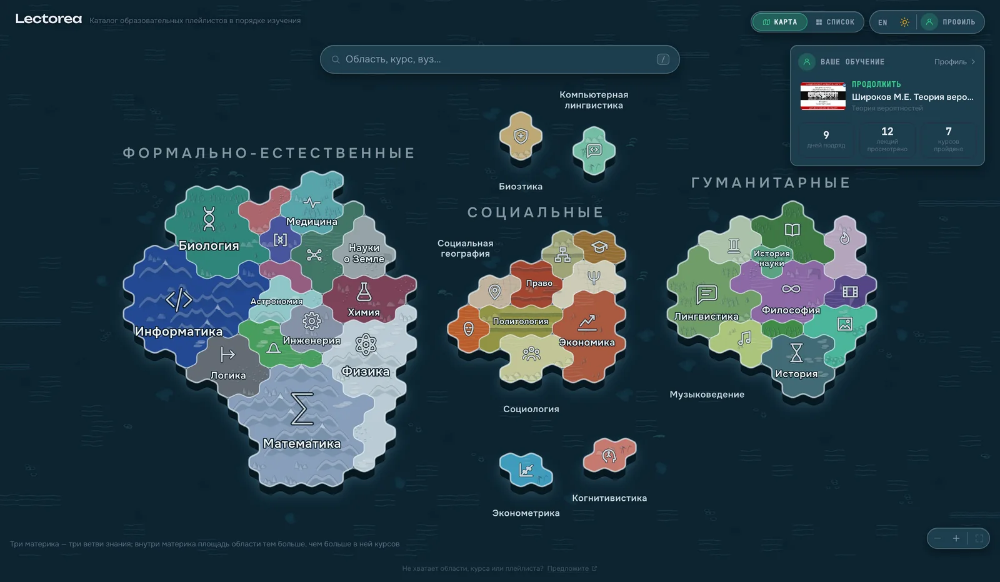
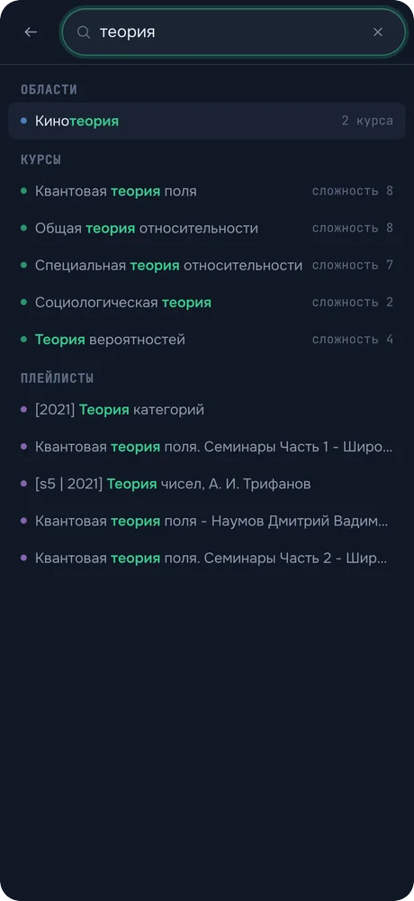

# The interface

[← docs](README.md) · [the live site](https://lectorea.org/)

Two places, and the screens inside them.

**The catalogue** answers "what is there" — the map, the list, the columns, a
course. **The desk** answers "where was I" — what was playing, what today came
to, what the graph has opened up, and the shelves of everything marked. They
share no address and no chrome: which one a visit opens on is decided by
whether the profile has anything in it (see [the two front doors](#the-two-front-doors)),
and the switch between them is a control of its own — a pair of words in the
header on a wide window, a bar of three along the foot of a phone.

The settings are neither. The account the profile travels on, the theme, the
language and the file it exports as are a drawer opened over whichever place
you were in, and closed again.

## The two front doors

`/` is the map for a reader with an empty profile — a stranger, a shared link,
a crawler — and a redirect to `/learn` for one with a past here. The decision is
made during the render rather than corrected afterwards: the profile is read
from `localStorage` when the store is created, so it is already in memory and
nothing flashes ([`src/lib/entry.ts`](../src/lib/entry.ts)).

It fires on **arrival** and never again, which is what keeps the wordmark
working. Home is the map, and a rule saying "a reader with history never sees
the front page" would take that door away: press it, and the desk you had just
left would come back. The distinction is read off the router's own location key
— React Router stamps the entry a session opens on `default` and gives every
later one a key of its own — rather than kept as a flag somebody claims, which
`StrictMode`'s double render would eat.

What was there before was one door and a badge on it: the map for everybody,
with the answer for the returning reader folded into a plate in the corner and,
on a phone, into a bar one line tall — under the zoom controls, the map/list
switch and the contribute line, in a band a thumb covers entirely. A catalogue's
front page and a reader's own study are two questions, and the second one was
being answered in forty pixels.

## The map — `/`

The way in. Three continents — formal and natural, social, humanities — with the
fields of knowledge marked out on them as territories, each sized by how many
courses it holds and carrying an icon, so the empty outskirts are visible as
work still to be done.

It is two drawings of one world — `public/map.svg` and `public/map-portrait.svg`
— carrying coastlines and territory outlines and nothing else, with the colours,
the lettering and the sea painted by the app, so the whole map follows the light
and dark themes. Which one loads is decided by the shape of the window and not
by the size of the device: see [two shapes of paper](#two-shapes-of-paper) below.
It is a plan on disk and a view
on screen — the app lays the ground back a little and stands the continents in
the water as slabs with a cliff at the coast, the same projection the tile
collection draws in ([tiles.md](tiles.md)). The ground inside a territory comes
from that collection, and so does the water around them.

Each continent is a climate — the formal one ice and stone, the social one grass
and sand, the humanities wood, water and heather — and each field inside it is a
biome: a range, a glacier, a steppe, a marsh, with an island biome that exists
nowhere on the mainland. One table says which country a field is and, on the
same line, what colour it is painted, so a continent reads as one place and no
two neighbours look alike ([biomes.md](biomes.md)); the grid is read back off the
outlines rather than stored, so a redrawn map keeps its ground.

Pick a territory to enter the columns filtered to it, or search.

The map is moved rather than looked at: two fingers on a trackpad carry it, a
pinch or `⌘`/`Ctrl` and the wheel magnifies about the pointer, and dragging does
what dragging a map does. A press that turns into a drag stops being a press, so
the territory under it is not opened. Three buttons in the corner do the same
for a pointer with no second gesture in it, and the last of them puts the map
back. It goes in four times and no further — that is one continent filling the
window, and past it a reader is looking at two territories and a lot of
hexagons.

The lettering only half follows. Everything written on the map — names, counts,
icons, the halo behind them — takes a share of the magnification rather than all
of it, so four times in the ground is four times bigger and the names not quite
twice. Growing with the ground would make going in pointless: the same map at
the same density, drawn larger. Holding perfectly still is the other mistake —
a continent filling the window, read through eight-pixel labels. A share gets
both: the names shrink against the territories, so fields that had to put their
names out at sea, or go unnamed until pointed at, take them back — and they are
still comfortable to read at the far end.

The size the map comes to rest at is what all of that is measured from, and it
is arrived at from two boxes rather than one. `map.svg` is a rectangle with the
continents in the middle of it and a third of its width in open water round the
outside; fitting the rectangle to the window drew the land at two thirds the
size of the room it had. So the land is what the window is measured against and
the water is what runs off the edges — up to a comfortable width, past which the
land stops growing and the sea around it grows instead, so a large display gets
the map at a readable size rather than a wall map and a name is the same size
there as on a laptop.

The window it is fitted to is not quite the window either. The drawing runs edge
to edge and passes under the header — the sea has to carry on behind the
wordmark, or the header reads as a lid on it rather than something lying on it,
and dragging the map has to slide the land under its own controls. What the map
is *fitted* to is the part nothing is standing on, so the northernmost names
come to rest below the search field even though the water behind it is theirs.
The lettering with no plate under it takes the same halo the map gives its own
names.

### Where you were

A front page answers "what is there"; somebody who has been here before is
asking "where was I". That reader now gets [the desk](#the-desk) on
arrival, and this is what is left on the map for the visit that goes back to
it: the lecture that was playing, what today has come to, and the numbers that
say whether the habit is alive — days in a row, lectures this week, the hours
of it where nothing else is already saying them — and, for anybody who has set
one, how far into the week's goal that is.

Three windows, three shapes, and the narrowest of them has none. On a wide
window it is a plate in the corner and on the list view the first section of the
page; between the two — a window too narrow for the corner and too wide for a
bar of places — it is one row at the foot of the screen. On a phone it is
nothing at all, because the desk is one of the three tabs down there and the
same offer twice would cost the map its own foot again. A profile with nothing
in it shows none of it anywhere.

**Three horizons, and each of them said once.** A card in the corner of a map
can carry three kinds of number and they answer three different questions, so
each has one place on it and one job:

| | The question | Where it stands |
|---|---|---|
| **The day** | what do I do now | under the offer, in the same block as the press that answers it |
| **The week** | how is it going | the tiles and the bar under them |
| **The recording** | how far into this one am I | the thin line inside the offer |

The day is the only thing on the card that **asks** for anything — «Сегодня —
25 из 45 минут · ещё 20 минут» — and it stands a line under «Продолжить»,
because the ask and the press that answers it are one decision and were three
screens apart. It is the same line the player shows between lectures, the same
component reading the same log ([the player](#what-makes-a-long-recording-finishable)):
there is one sentence about today in this product and two places it is needed.
The week asks for nothing. It is the standing — a bar that already has
something in it on a Monday evening is the reason the day's twenty minutes look
worth doing, and a reader arriving at the site should be able to see both in
one glance without being told off by either.

What paid for the day's line is the hours tile. «1,8 из 4,5 ч» on the bar
contains «1,8 часа за неделю» whole, and the tile was spending a third of the
row to add the word «часа» — so where the bar is drawn the tile stands down,
and where there is no goal it stays, being then the only place the week's hours
are said. Three horizons, one line taller than nothing.

Once the day is made the ask becomes the news — «День закрыт · 3 из 5 дней
недели», accented — and once the week's days are all made it stops asking
altogether: «Неделя выполнена · 5 из 5 дней». A goal of «45 минут, 5 дней» is a
week with two days off written into it, and a line asking for a sixth would be
the site handing out a target nobody set.

**And the invitation, for the reader who has never set one.** The goal's slot
is empty until there is a goal, and into it goes «Поставить цель» — but only
once there are three days of study in the last four weeks, which is the same
floor the pace uses before it will average anything. Under it there is no habit
to describe, only a visit or two, and a target offered then is the debt the
whole design refuses to hand out; above it the goal describes what somebody is
already doing, and the control was three presses away behind an avatar. It
opens the panel, where the choosing belongs, and the card's × puts it away with
the rest of the card.

The numbers are about the week in hand rather than about everything, and the
week starts on Monday. A lifetime total is a monument, and a monument says
nothing about whether anybody is still studying: «312 лекций просмотрено» reads
exactly the same on the morning somebody starts again and on the morning they
give up. The run of days is the one figure here that reaches past the week — it
is what the week is being kept for — and the totals are still in the profile
panel, which is where somebody goes to look back rather than forward. A quiet
week does not take the card away: it is the profile being empty that does that,
not the week being.

The hours are hours **of the lectures**, not hours at the desk, and the
difference is the speed. The embedded player reports where the playhead is
about every five seconds, and what counts is how far it travelled between two
reports: an hour of a recording watched at 2× is an hour of that recording,
done in half an evening. That is the only reading under which the two ends of a
bar are in the same unit — the catalogue measures a course in its own hours,
«82 ч» being the sum of its lectures, so counting the reader's side in minutes
of wall clock would make «0,1 из 3,4 ч» mean something different for every
reader. The ceiling that keeps it honest is what could physically have been
played: the time the stretch actually took, times the speed it was running at,
so a seek across an hour of a recording is credited as the press of a button it
was rather than as an hour of studying (`watchedBetween`, and the test beside
it). Everything marked off by hand is credited its full length instead, because
there is nothing to measure: a playlist sealed as watched is worth the lectures
under it that had no tick of their own, and a lecture the player finishes on its
own is worth nothing extra, having already been paid for as it played.

The pomodoro's clock is the other one — the wall — and the two are not
reconciled anywhere, because they answer different questions: a session is
twenty-five minutes of somebody's evening whatever speed the lecture runs at.
See [the pomodoro](#a-timer-over-the-lecture).

The avatar stays in the header either way, and it is the only door: the card
used to carry a «Профиль ›» of its own, a thumb away from the button in the
corner saying the same word. What the corner of the card holds instead is a ×.
This is a reader's own study looking back at them and there are mornings for
that and mornings not, so it can be put away — for the visit, not for good. The
dismissal is held in the view state and never written to the profile: a setting
nobody remembers making is a card gone for ever, with no way back that is any
easier to find than the panel it was pointing at. A reload brings it back.

The offer carries a bar, and a pair of arrows. How far through the recording
somebody is goes under it as a thin line with a percentage — the same reading
the panel gives — and where there is more than one thing on the go, the arrows
under the offer leaf through them, with «1/5» between them saying how many there
are. Both wrap, and nothing is disabled at either end, because there are no
ends: one arrow was enough to reach everything and not enough to use, since
overshooting by one press meant four more to come back round. They ride in the
heading beside the ×, packed tight — a row of their own read well and cost the
card a whole line, and on a plate holding an offer, a bar and two tiles the line
spent on chrome is the one a reader notices. What pays for the space is the card
being wide enough that the heading survives beside them: «ПРОГРЕСС ·
МАТЕМАТИКА» whole, which is the part that must not be given up, since it names
what the tiles are counting. Twelve is as far as the ring goes; sixty openings
is a history browser, and the profile panel is already that.

Almost nothing on it costs a download. The playlist that was open last, the
lecture that was playing, the ticks and the days of study are all in the profile
already. The bar is the exception — lecture lengths live in the shards and
nowhere else — so it costs the shard of the course being offered, median 69 KB,
fetched after the card is already on screen and for a file the press is about to
need anyway. The card reads without it and the bar arrives when it lands.

The drawing is not moved out of its way. Both shapes float over open water at
the size the map opens at, and a card that made the continents shrink to avoid
covering sea would be charging the whole map for a corner of it.

### Two shapes of paper

A map of three continents ranged side by side wants a window wider than it is
tall. Fitted into a phone held upright it is a strip of land across the middle of
a great deal of water, with the names at three pixels — and no amount of zooming
fixes the shape of the paper. So a phone used to be sent to the list whatever it
asked for.

There are two drawings now. The same generator lays the same territories out
again with the continents stacked instead of ranged, and writes
`public/map-portrait.svg` — same areas, same dependency order read bottom to top
inside each continent, same landforms, a canvas the shape of a phone. Nothing is
hand-placed and nothing is a second copy of the catalogue: add a domain and both
files are one command away from carrying it. See
[the pipeline](pipeline.md#the-two-maps).

Which one loads is a question about the window rather than about the device —
`(orientation: portrait)`, so a tablet held upright gets the stacked one and a
phone turned on its side gets the ranged one. Turning the device swaps the file
and re-fits it: the two are different worlds, and carrying a reader's zoom from
one into the other would land them somewhere else entirely. The cell size, the
depth of the cliffs and the chrome the land is kept clear of all follow the file
that actually loaded rather than the one that happened to be written first.

The tall map also does not open on the whole of its world. Stacking the
continents fixes the shape of the paper but not the arithmetic: three continents
fitted into a phone still puts every name at four pixels. So the plan carries a
third box beside the land — where the map *opens*, measured down from the
northern coast, far enough to hold the first continent, the whole of the second,
and the northern shore of the third, which is what says there is more below. The
corner button still shows the world entire, and out is still bounded by it; what
changed is only where the map starts. On a wide window the two boxes are the
same box and nothing about the map moves.

Lettering is measured in cells rather than in map units, so a field of eight
hexes is named the same way on both maps whatever grid each is drawn on. The
tall one is then set larger still, and that part is a decision rather than a
correction: it is read on a phone at arm's length, where a name wants eleven
pixels and not eight. Fewer names fit inside their own borders at that size and
more go out to sea or wait for the reader to come closer — on a screen that size
the better trade, and the same one the map has always made.

The other view is still there, and is still the same catalogue drawn as a grid of
cards — «Список» in the header, `blocks` in the code, and a reader who wants
names rather than a drawing never has to learn the map at all.

Both views are now a choice on every screen. On a wide one the switch sits in the
header; on a phone there is no room for it beside the wordmark — and a control
that decides what the whole screen is belongs under the thumb rather than in the
far corner — so it floats at the foot of the screen instead, thumb-sized, in the
same place over both views. Over the list it rides the bottom of the scrolling
column rather than standing over the middle of a card.

That choice
lasts the visit and no longer: the map is the front door, so every visit opens
on the drawing, and the wordmark leads back to it from anywhere. The way back
from the columns is the other half of that pair — it returns to the view you
left, the list included, and says which one it is.

## The columns — `/fields/<id>`

The catalogue proper, and always seen through something. One field of knowledge
is the address itself — `/fields/chemistry` — and any other combination of
filters is a query string on `/courses`; the whole catalogue with nothing set is
not a screen at all, because 225 cards across nine columns of every subject
answers no question, and a reader who lands there is sent back to the map.
A course opened by its bare address brings its own fields along with it, which
is what makes a search result land in a slice rather than in the wall
([hosting.md](hosting.md#a-field-is-a-page-not-a-query-string)).

A column is «сложность N» — the length of the longest
chain of prerequisites ending at that course — so reading left to right is
reading how much has to come first, and a line above the columns says exactly
that.

In the corner over them, for a reader who has been here before, is **their own
standing in the slice on screen** — the front page's card
([where you were](#where-you-were)), on the same plate, asked of this field
instead of the catalogue. Both halves narrow with the filter: the recording
offered is the last one opened *in this field* — and so is everything the arrow
leafs through — while under it are two counts of *these* courses, «1 пройдено ·
2 изучается». A card that kept the global numbers under a heading naming the
field would be the worst of the two, scoped-looking and not scoped.

So the heading names what it counts: «ПРОГРЕСС · ХИМИЯ», and «ВАШ ПРОГРЕСС» with
no filter, where the slice really is everything. It does not try to decline
the name into «в Химии» — the catalogue holds «Науки о Земле» and «Компьютерная
лингвистика» too, and a product guessing at Russian cases gets one of them wrong
in public. The counts cost nothing to work out — course status is in the profile
— and there is deliberately no third one saying how many courses the field
holds: that was the denominator the other two are shares of, and the one number
on a card headed «ваш прогресс» that is about the catalogue rather than about
the reader. It is on the map, on the filter row and in the columns being
counted. Lectures and hours in a field are not offered either: they need every
shard of the field, where the bar under the offer needs one. Filter to a field
nothing has been watched in and there is no card at all — zeroes over somebody's
first visit to химия is a scolding.

It floats rather than sitting in the flow, and that was the second try. As a
strip across the top it pushed every column down by its own height on every
visit, and the columns are read by scanning down them — two centimetres off the
top is two centimetres off all seven at once. Floating it costs the screen
nothing and covers a corner of one column, which is scrolled past rather than
lost. It is there only while nothing is selected: a selection is a chain lit up
across these columns and a panel naming it, and the panel carries its own
«Продолжить» anyway — a better one, naming the lecture rather than the
recording. The × is the front page's ×, and means the same thing wherever it is
pressed: not this visit. Pressing the card itself keeps the filters exactly as
they are and scrolls the course into view, so what opens has a visible place to
have come from.

Selecting a card lights up what it needs, fades the rest and draws the curves
along that chain, and only that chain — over 200 cards they were a web of noise,
but over the six or seven of one path they answer what the columns cannot, which
of the cards on the left this one actually needs. Select a course and the line
above changes to say so — half the screen has just dimmed, and the legend
explaining the columns would leave the reason for it unsaid; the **?** beside it
opens the full legend, which also appears by itself on a first visit.

One card is marked out, and it is the one being read: a ring, and every other
card in its own field's colour. The chain used to be painted as well — an accent
border and a wash behind every card in it — and with half the screen ringed in
shades of one green the card you had actually clicked was the hardest of them to
find. What separates the chain from the rest is that the rest is dimmed and
drained of colour, and that the lines run along the chain and nowhere else.

Backwards only. «Открывает путь к» is the same relation read from the other end,
and it is named in the panel rather than drawn: the courses ahead are not
borrowed onto the canvas the way the prerequisites behind are, so a fan of lines
forward could only ever reach whichever of them the current field happened to
contain — an answer that looks complete and is not. Clicking one of them draws
it. That course becomes the selection, the relation is a prerequisite of it, and
it is drawn right to left like everything else on this screen, with the whole
chain behind it brought in.

Every edge of the chain is drawn, and for a while only some of them were. The
quieter drawing cut the chain back to a tree — one line out of each card, to the
nearest course that needs it — so that following any line still arrived at the
selection and nothing was left unconnected, but a course standing on two
prerequisites had one of them drawn: biochemistry needs organic chemistry *and*
cell biology, and the tree drew one. Sequence analysis went from 22 lines to 18,
molecular biology from 8 to 6.

`deps` is already a transitive reduction — the build warns on any edge the graph
implies — so of the 1188 lines drawn across every chain in the catalogue not one
is redundant, and the 191 the tree dropped were exactly the second prerequisites
of the courses that have more than one. It was offered as a switch until it was
counted over all 197 chains: the tree drew 184 cards with fewer prerequisites
than they have, and bought that with 29 crossings across the whole catalogue —
174 of the 197 screens have none either way. The switch went because the loss
cannot be noticed. One line into a card reads as «this is its only
prerequisite», nothing on screen says otherwise, and nobody could know there was
anything to press. The one thing the tree never hid is the selected card's own
prerequisites, and that is structural rather than lucky: an edge into the
selection could only be dropped in favour of another course in the chain, which
would make it transitively implied, and the build refuses those.

Every line is drawn at right angles: out of the card, along to a lane in the gap
between columns, down the lane, into the next card, corners rounded. Everything
leading into one course shares its lane and arrives together, which is the fork a
chain actually has.

A line that skips a column gets two lanes and a row channel — down the gap to the
right of the card it leaves, across the horizontal gap *between* two rows, then
down the gap to the left of the card it enters. Rows line up across columns, so a
channel clear in one column is clear in all of them, and the line passes between
the cards rather than over them. That is the case a curve drew worst: a long
diagonal sweeping across whatever stood in the way.

The columns stand 48px apart rather than 24 to pay for it, because a lane needs a
corridor. Curves were offered as a second drawing beside this one for a while and
the choice was withdrawn: the merge into a shared lane is what makes a fork
legible, and a screen that says something different depending on a switch is two
screens to explain instead of one.

Cards of one field stay together vertically, so switching on a domain filter
lights a stripe rather than a spray. The columns scroll sideways and say so: the
edges fade where there is more, and stop fading at the ends. Opening the panel
brings the selected card back into view rather than letting it disappear under
it.

Each card carries its one-line description and the stage a person normally meets
that course at — «9 класс», «2 курс», «аспирантура». That is the question people
arrive with, and it is not the same as the column: «Введение в социологию» and
«Школьная алгебра» share a column while one is a first-year university course
and the other is school.

## Filters

Three sit in the header:

- **Ступень** caps the catalogue at a school year or a university one — pick «11
  класс» and everything past it disappears, in every field and in the next
  session too, because it says something about the reader rather than about the
  view.
- **Область** and **Вуз** are per-view and searchable, and both name what is
  selected instead of counting it.

A domain filter shows that field and nothing else — not even a prerequisite from
elsewhere, which as a faded card several columns away read as part of the field
you asked for. Those live in the panel instead.

Two kinds of card are borrowed back, and only while a course is selected: the
selected course itself when the filter does not cover it, and every prerequisite
its chain runs through, however far back. Game theory needs probability,
probability needs combinatorics — with probability filed under another field the
card lit up with nothing drawn behind it, and «Опирается на» in the panel named
a course the columns refused to show.

The whole chain, not one hop. Stopping at the direct prerequisites was tried and
only moves the broken end one column to the left: combinatorics goes missing
instead of probability, on a screen whose whole claim is that reading left to
right is reading the order things must be studied in. The cost is bounded by the
chain — three cards on average, seventeen at the worst, which is what sequence
analysis genuinely stands on — it is spent on an explicit click, and it is
dropped the moment the selection changes. With nothing selected the field still
decides what the columns hold.

Both are paid for by a click, and a click is the only thing that moves the
columns. Pointing at a course the panel names — «Открывает путь к», «Также
полезно», «Рядом», a step of the path — lifts its card where it is already
standing and draws the edge between it and the course being read, in whichever
direction the catalogue has it: so the courses ahead, which the canvas otherwise
leaves undrawn, are drawn one at a time by the reader asking for them. Only where
the relation really is a prerequisite — a line here says «this has to come first»
and nothing else, so «Также полезно» and «Рядом» light their card and draw
nothing.

A name whose card the filter is not showing lights nothing, and that is
deliberate. It used to fade the card into its column for as long as the pointer
was on it — «Открывает путь к» is usually somebody else's subject, so under a
field filter that is most of the list — which meant the columns re-laid
themselves out under a pointer that was only crossing the panel on its way
somewhere else: eight names is sixteen cards arriving and leaving, each one
shifting the column below it, none on screen long enough to read. Pointing
paints; opening the course is what brings it in, with everything behind it, in
one move.

A borrowed card carries a tag naming the field it came from, and pressing it
moves the columns to that field with the course still selected.

## Search

The search box matches titles, abbreviations and slang (`теорвер`, `линал`),
because morphology here is a list of forms, not a stemmer.

**Words, not a phrase.** When what was typed is not in any title as it stands,
every word of it has to land somewhere instead — the title, the channel, the
keywords — and all of them have to land, which is what makes «мфти линейная
алгебра» find five МФТИ recordings whose titles say neither «МФТИ» nor those two
words in that order. Recordings are named by whoever published them, with the
lecturer after the subject and the university only in the channel name, so a
phrase search finds the catalogue's own titles and misses everybody else's. A
row found this way marks the words it matched, the same way a phrase does.

**A pasted YouTube link.** Anything YouTube issues an address for is understood:
the playlist page, a lecture out of one with `list=` still on it, `youtu.be`,
the mobile and music hosts, the share form's tracking parameter, an embed, or
the bare id on its own. The catalogue already knows playlists by exactly that
id, so the link is answered by the recording itself, with the course it belongs
to beside it. A link it does not hold says so and offers the form to propose it,
with the address already filled in — and a link to a single video, a channel or
one of YouTube's personal lists (watch later, a mix) says which of those it is
rather than pretending to have searched for it.

It opens on focus rather than on the first keystroke, and before anything is
typed it already holds rows.

On the map those are the largest areas, courses and
universities under their own headings: a field that says «Область, курс, вуз…»
is worth more when it shows the three rather than asking to be believed. Beside
the columns it opens on that slice instead — the courses and recordings that
survive the filters, since once a field has been picked, «the biggest area» is
no longer an answer to anything. Typing still reaches the whole catalogue; a
filter says what to look at, not what exists.

On a phone the search is its own screen — back arrow, full-width field, the
whole height for the list — and backing out of it leaves nothing typed behind.
Above the columns what opens it is a search icon: that row is three filters deep
already, and an input wedged into the 160px left between two buttons is a target
you have to aim at, dropping a list read through a letterbox. On the first
screen there is room for the field itself, so the field is what you tap — the
same screen opens, and course names arrive with the width to be read whole
rather than cut at «Дифференциальные уравне…».

## The course panel

Selecting a course opens it; the × in the panel, or a click on empty space, puts
the columns back to full width.

On a phone it is a sheet that comes up over the list and stops with the row it
was opened from still in sight. Drag it up for the whole card, down to put it
back, down again to send it away — or tap the grab bar to switch between the
two, and the × or the dimmed list behind it to close.

A course already under way opens with the way back into it: the lecture that
comes next, on a still, over the bar that says how far along the recording is
and which recording that is. Which one is not a choice being made here — a
course carries thirteen recordings and the panel has always drawn its bar from
the furthest-along one ([progress](#progress-down-to-the-lecture)); it simply
never offered it. Before this, coming back meant scrolling past the description
and the whole path block to the list, then working out which of thirteen rows
the percentage above had been about. The press opens the player at that
recording, where the poster is already saying «Продолжить с лекции N» — it does
not start the video, because 800 KB of embed on a press that might have been
aimed at the title is not a favour. It is the same block the front page offers
([where you were](#where-you-were)), which knows the recording but not what is
inside it; here the shard is in hand, so the offer is the lecture itself.

- **Опирается на** and **Открывает путь к** are the same relation read in either
  direction, so they use the same card and sit next to each other, whichever
  field the neighbour comes from, with the full chain below the pair. On the
  panel each list caps its height and scrolls inside itself: a course that opens
  eight others must not push its own recordings off the screen. Pointing at any
  of these cards shows the course where it stands in the columns — borrowed in
  if the filter is not showing it — and draws the line between the two
  ([the columns](#filters)); pressing it opens that course, and what was
  «открывает путь к» is drawn as «опирается на» from the other end.

  On a phone the three of them fold into one line — **Связи и путь**, and under
  it which course to start with (the first step still unmarked, never one that
  already carries a tick) and what the whole path costs. Three sections of
  neighbouring courses used to stand between the title and the playlists the
  sheet was opened for. The fold is one answer for every course: it is kept in
  the profile, so a reader who wants the structure unfolds it once.
- **Path** — everything that has to come first, in order, with an hour estimate,
  a progress bar once there is progress to show, and how much of it you have
  already marked done. «Export» copies it to the clipboard and downloads it as a
  Markdown checklist with links.

  

  **Where the hours come from, said where they are printed.** A course's «≈33 ч»
  is the *median* of the recordings found for it, not their sum: a course carries
  thirteen and they are alternatives, so the honest length of it is the length of
  one ([data.md](data.md#fields-computed-at-build-time)). The path's «≈71 ч» is
  those medians added along the chain, the finished courses included, and
  «осталось ≈43 ч» is the same sum with the ticked-off ones dropped — a course
  under way still counts whole, because the lectures inside it move the bar and
  not the estimate. Every one of those figures carries the sentence itself, in
  the tooltip — the chip, the summary line, «осталось», and each step's own
  hours down the list, where the bubble also holds the unrounded number the row
  is rounded from. A number arrived at by a rule nobody can see is a number
  nobody believes, and the reader who wonders is looking at the figure, not at
  this page. On a phone, where there is no hover, the label chips and the quiet
  captions open their bubble on a tap.

- **Playlists** — the concrete recordings of that course, sorted by a bayesian
  rating rather than raw views.

  A row says four things, in four places. The **name** leads: the recording's
  own title with everything the screen already says taken out of it — the course
  name, the university, the lecturer, the term and the year — so what is left is
  the part that tells this recording from the one under it, and the university
  and lecturer follow it in a quieter grey. Roughly half the catalogue has no
  name of its own once that is done, and those rows simply start with who
  recorded them. Under it are the **facts**: year, language when the filter
  admits more than one, how many lectures there are and how many hours they come
  to — or, once you have started, how much of each is behind you. The hours
  replaced a word for the average lecture («пара», «урок»), which named a number
  the reader could already divide out and answered the question nobody asks
  first. Opening that line is the **type** — «Подборка», «Семинары», «Полный
  курс», «Разная длина» — which says what the thing is and never how good it
  is. On the right is the **status**, which says only how the
  numbers came out, and nothing about what the thing is. A finished playlist
  wears a «Просмотрен» plate, the same one a finished course wears.

  The university and the lecturer are pressable, on the row and in the player:
  they were captions about the recording, and getting the rest of what that
  lecturer read meant carrying the name up to the strip and finding it in a menu
  of two dozen. A press writes the same filter the menu writes and puts up the
  same chip, so it is a shortcut to the tick rather than a second kind of
  filter; pressing the name again takes it off. In the player it also closes the
  player, because the answer is the list behind it. The university is only
  pressable where the row is naming one: a third of the catalogue was found on a
  course page rather than on a channel and sits under «Прочие каналы», where the
  name on the row is a channel and a filter made from it would fetch a hundred
  unrelated ones.

  A course a university cut into parts — «Часть 2», a second semester, `[s3]` —
  is drawn as one entry: the parts in order, a rule down their left and **Части
  одного курса · 78 ч** over them.

  The hours are the sum of the rows underneath and nothing more, which is what
  makes them printable: four semesters at «19.9 ч» each is a sum the reader
  would otherwise do in their head, and it is the figure that decides whether
  this is a term's work or two years'. It is also what makes a run comparable
  with the single recordings it is ranked against — ИТМО's four-semester
  «Дискретная математика» reads 78 ч where MIT 6.042J is 33 ч, and until the run
  said so the list put a two-year programme next to a one-term course with no
  way to tell them apart.

  The wording carries the rest of the truth. The heading used to read «Один
  курс», and with a number beside it that is a claim the catalogue cannot
  support: 24% of the 149 runs visibly start at part three, skip a part, or
  carry one marked «фрагмент», and the other 76% are not *proved* whole — they
  are runs with no hole anybody can see. A fifth semester that was read and
  never filmed leaves no trace to find. Two headings, one for the complete runs
  and one for the rest, would only move the false claim onto the 76%. So there
  is one line and it is the modest one: these rows belong to one course, and
  together they run this long. Where the course ends is not ours to say.

  The count of parts is the number that stays missing entirely: it came off the
  highest number we could parse out of the titles, so a run of `s3, s4`
  announced four parts above two rows. **The rule the three cases make between
  them: a number summed from the rows on screen may be printed; a number
  inferred about the course they came from may not — and the words around the
  number are part of the claim.**

  **Части вместе**, next
  to the sort, turns the grouping off for anyone hunting one recording rather
  than a course to sit down with, and appears only where there is a run to
  group. With it on, a run is admitted or rejected whole: one part passing the
  filters brings the rest with it, because a group drawn with the middle missing
  renumbers somebody's course.

  Filter by language, provider, lecturer, type, lecture
  length, captions, year, completeness; hide what you have watched.

  The language filter starts on the language of the page — the Russian site
  opens on Russian, the English one on English — and stays there even for a
  course that has nothing in it: rather than quietly dropping the filter, the
  list says there is nothing in that language and shows the other languages
  underneath, so «no Russian lectures on this at all» is something you learn
  instead of something you infer.

  Once you move it, that is where it starts from then on, on this course and on
  every course after it — **including when you clear it**. The two are different
  answers and the profile keeps them apart: never touched is a guess the site is
  making, and an empty filter is somebody saying they do not care what the
  lecture is in. A filter that re-seeded itself on the next course would tell
  the reader who cleared it that they are seeing everything while it hides half
  the catalogue from them, which is the one thing a filter must never do.

  The filters
  sit in one strip that scrolls sideways, ordered by how often they are reached
  for, and the button at its end unfolds the lot; sorting has its own row,
  because at the end of that strip it read as one more filter. The provider and
  lecturer lists are searchable — here and in the header above the columns — and
  every one of them names its rows before anything is typed, most first, so the
  field narrows a list you can already see rather than asking you to guess at a
  spelling. The lecturer filter disappears for a course whose recordings name
  nobody.

  

Marking a course cycles it through *nothing → in progress → done*, which is what
makes "what can I study right now" answerable.

## On a phone

Every screen has a phone shape, and none of them is the wide one scaled down.
The rules, and where each is argued in full:

| | On a wide window | On a phone |
|---|---|---|
| The map | three continents ranged, fitted whole | a second drawing with them stacked, opening close in — [two shapes of paper](#two-shapes-of-paper) |
| Desk or catalogue | two words on a plate in the header | three tabs along the foot of the screen: обучение, каталог, профиль |
| Map or list | a switch in the header | a switch under the search field, on the screen it changes |
| Where you were | a plate in the corner, a bar between the breakpoints | nothing on the map — the desk is a tab, one thumb away |
| The map's controls | zoom in, zoom out, fit | fit alone: pinching goes in and out, and nothing but a button puts the world back |
| The catalogue | columns that scroll sideways | one column of rows, folded by difficulty |
| A course | a panel beside the columns | a sheet over the list, dragged up for the whole card — [the course panel](#the-course-panel) |
| Links and path | three sections, always open | folded into one **Связи и путь** line, and the fold is remembered |
| Search | a field in the header | its own screen, full width and full height — [search](#search) |
| The desk | a page, at `max-w-4xl` | the same page, its shelves one card wide |
| The drawer | a modal, reached by the disc in the corner | a sheet, reached by the third tab |

**One thing floats over the foot of a phone, and it is the places.** There were
four: the zoom controls, the resume bar, the map/list switch and the contribute
line, stacked in the band a thumb covers entirely, with the most important of
them — where you had stopped — drawn smallest. Two are gone, one moved up beside
the search field, and what is left is a bar that says the same thing in the same
place on every screen it appears on. The switch between map and list went *up*
rather than away on purpose: it changes what the screen is, which is a question
about the view, and the foot is now about where in the site you are.

Between the two windows there is still a bar: a window too narrow for the corner
plate and too wide for the tabs gets the lecture in one row, with the run of
days at its end and today's goal as a ring round it. A run is kept by closing
today, so the two belong on the same mark rather than on two. What a ring cannot
say it says in the label a screen reader reads out: «3 дня подряд · Сегодня — 25
из 45 минут».

The header is the one place something has to give. On the map there is room for
the wordmark and the search field itself; above the columns the row is a way
back, three filters and the theme, language and profile buttons — so the search
becomes an icon there, and the filters keep the width, being what that screen is
for.

**It installs.** The build ships a PWA manifest and a service worker
([`vite.config.ts`](../vite.config.ts)): added to the home screen the site opens
in its own window with the canvas colour behind it, and everything already
fetched — the bundle, the map, the catalogue files — is served from cache, so a
reader who has looked at a field once can look at it again on the underground.
The catalogue's own JSON is stale-while-revalidate: what is on screen is
whatever the last visit saw, replaced the moment the network answers.

## Progress, down to the lecture

Opening a recording gives the player, the lectures under it with a tick each,
and — on the right — the recording said in three shapes: how much of it there is
(lectures, hours, an average lecture, as tiles), what it is (a chip each for the
type, the length of a lecture, the subtitles, and «фрагмент» where it is one),
and the same numbers the rating was computed from, each beside the scale it is
read against, so a status can always be traced back to what produced it
([rating.md](rating.md)). Which fact gets which shape is not a matter of taste —
[the design system](design-system.md#three-shapes-for-a-fact) sets it, and it is
why none of them is a «характеристика · значение» line any more. The
poster says «Продолжить с лекции N» rather than «Play», because after the first
session that is the only offer worth making.

### Reading about a recording, and watching one

Those are two different sittings, and the dialog has a shape for each. What is
described above is the first: a frame across the top at a comfortable size, the
lectures under it, and everything the catalogue knows about the recording down
the side — the shape somebody is in while deciding whether this is the course to
take on.

The glyph — in the corner of the header, and again under the right-hand corner
of the picture where a player keeps that button — and pressing play, put it in
the other. The dialog grows to the width and height it can have, the frame takes
whatever the dialog has left over rather than a stated ratio, and the lecture
list moves to the side and becomes the queue: the row playing is lit, it brings
itself into view when the player walks on without being asked, and the
recording's own progress stands over it — «11 из 26 лекций · 12 из 29 ч» — so
what is left of the course is answered where the next lecture is chosen. That is
the screen for the hour somebody actually spends here, and it is deliberately
not fullscreen: fullscreen is YouTube's own and takes the ticks, the queue and
the progress away with it.

**The queue is also where the lecture in the frame is described.** Its row is
the one that does not truncate its title, it fills to where the playhead
actually is with the position beside the length — «15:08 / 29:30» — and the
tick at its end is what marks the lecture off. There used to be a strip under
the picture saying all three again, with a pair of arrows for the lecture
before and after; every word of it was a second copy of the row a centimetre to
the right, and every control on it a second way to press what that row already
answers ([the practice](agents/practices.md#a-strip-that-narrates-the-current-row-is-a-second-copy-of-it)).

The queue is a **stated width** and the picture takes everything the dialog
grows by. A column of numbered titles and a length needs about twenty
characters; every pixel past that comes out of the one thing the reader is here
for, and a share of the width would hand the queue a third of a large display.

Under the picture is one strip and nothing else: the speed on the left, the way
back out of the watching shape on the right. What a YouTube embed will not say
for itself — which lecture this is of how many, how far into it the playhead is,
whether it is behind you — the queue says, permanently, about the row it is
about; the embed says it only while its chrome is up, and the chrome goes away a
second after the pointer does. On a phone the frame and that strip stop
scrolling with the page and the queue scrolls under them, which is the one thing
a phone owes a screen somebody watches an hour of video on.

**The fact sheet does not travel.** It did once, under the queue behind a
«О ЗАПИСИ» line, on the argument that how good a recording is gets asked as
often on the third lecture as on the first. What it bought was a screen of
scroll between the last row of the queue and the end of the column — in a column
whose whole job while a lecture runs is the queue — for questions that are in
fact asked *before* sitting down with a course: who is lecturing, how many
hours, is it any good. It is one press away, and the press is the glyph in the
header that was already there.

What does travel is what the queue is missing without it: the recording's own
progress, over the queue rather than at the far end of a sheet, and for a course
cut into parts «Часть 2» with it — the reader who has run out of lectures is
looking at the bottom of the queue. One lecture list either way, one set of
ticks, one set of numbers.

Nor do **«В избранное» and «Отметить все 26»** travel, the two buttons in the bar
below. Both are decisions about the recording as a whole and neither is a thing
anybody does while a lecture is running — on the watching screen they would be
two full-width buttons of nothing to do, one of which wipes the ticks of a
course in progress. Marking off here is one lecture at a time, down the queue,
and the sheet somebody reads before starting still has both.

Which shape a recording opens in is **not** remembered, and that is the one
setting in this dialog that is not. It would buy nothing: watching starts with a
press on the picture whatever the shape, and that press is what changes it — so
the memory would only decide what somebody sees while *deciding* about a
recording they have not played yet, which is the question the other shape is
for.

**The frame keeps its place in the tree through all of it.** An iframe that is
moved in the DOM reloads, and a reloaded YouTube embed starts the lecture from
the top — so the two shapes are one tree with different classes on it rather
than two layouts, and everything that may move around the player is something
without a video in it. See
[the practice](agents/practices.md#a-live-third-party-frame-may-be-restyled-never-moved).

A part-watched lecture says where it stopped *beside* its length — «29:21 /
1:05:14», the position in the accent colour — and the row is filled to that
fraction behind the title, with the playhead marked where the fill ends. The
position used to stand in the length's place, which made one column mean two
different things depending on the row, and left a figure counting up on its own
while the lecture played with nothing beside it to be read against. The length
is the number that never moves, so it is the one that is always there.

The row the frame is on takes that figure **from the player** rather than from
the profile, and the difference is not freshness but what the profile is allowed
to hold: «Место остановки» switches the stored position off altogether, a
lecture already ticked keeps none, and anything under fifteen seconds is not a
place worth coming back to. All three silences are right about a lecture
somebody left and wrong about the one running beside the list — and the fill
stays put once the lecture passes 95% and counts as watched, because the tick
says whether it is behind you and the fill says where you are.

Three levels, and only the bottom one holds anything. A lecture is watched or it
is not; a playlist and a course are arithmetic over that.

- **A lecture** counts as watched at 95% of its length, or when the player says
  it ended. The last minutes of a recording are credits and a Q&A that trails
  off, and a bar that will not complete because of them is a bar people stop
  trusting. Not further short of the end than that, though, because the number
  is now read twice: as the tick, and as the moment «Дальше» appears in the
  strip under the picture. A threshold with a quarter of an hour of a long
  lecture still behind it would be offering the next one while there is
  teaching left in this one. Every lecture also carries a tick of its own, for
  the ones watched on YouTube — without it, everything watched outside this
  player would be invisible here, which makes the progress it shows a lie of
  omission. Shift extends from the last tick, so twelve of thirty is one press
  and not twelve.
- **A playlist** is the share of its lectures behind you. «Отметить все» is a
  seal rather than thirty ticks — a playlist here runs to 1192 videos — so
  taking it off uncovers what was actually watched underneath instead of wiping
  it.
- **A course** is the recording it is being studied by: the furthest-along one,
  with the last one played breaking a tie. A course carries thirteen playlists
  on average and they are alternatives, not parts; summing them would turn a
  course barely begun into one nearly finished.

Watching promotes the course on its own — started on the first lecture,
finished when a whole playlist is behind you, and the modal says so with a way
to disagree. Pressing the status button yourself claims the course, and the
automation then leaves it alone; clearing the status is not an opinion but the
withdrawal of one, so it hands the course back to being counted from lectures.

The path bar is counted in whole courses and filled in fractions: the label
says how many are behind you, and the lighter part of the bar is the course in
hand. Counting only milestones leaves the bar still for a fortnight while
somebody works through a forty-hour prerequisite; counting only fractions loses
the milestone.

### A timer over the lecture

A pomodoro, in the strip under the picture beside the speed — a clock and the
word, and on a phone the clock alone, since that strip is shared with the rates
somebody changes *during* a lecture and a word taking a third of the row costs
them the one they are watching at.

Pressing it opens the panel, and the panel is read downwards: the four numbers a
run is cut by — how long a session is, how long the gap between two, how many
sessions stand before the long rest, and how long that one is — and «Запустить»
underneath them. That order is the whole of it: the press is the answer to the
four questions above it, and with the button on top the hand had to travel back
up the panel after setting the last one.

They are ladders rather than fields, for the reason the day's goal is: the
decision is «about half an hour», not «twenty-seven minutes». They live in the
profile, so somebody who has decided a session is fifty minutes has decided it
for the term, and a length changed in the middle of a session takes effect on
the next one rather than moving the clock in front of them. Once it is running
the heading says what it is doing — «ПОМОДОРО · СЕССИЯ 3» — and the button at
the foot offers to stop.

**Starting puts the panel away**, because somebody who has pressed it is
finished with it by definition: they came to set the lengths and did, and what
they want in front of them now is the lecture with a clock ticking beside it.
Nothing else there does, since every other press *changes what the panel says*.
And the panel is sized to its content rather than scrolled — the ceiling that
turns a long *list* into a scrolling menu is wrong for a fixed set of controls,
where a row hidden below the fold is a setting nobody finds.

**The clock can also be moved on by hand.** While a session runs the panel
offers «Перейти к перерыву», and while a rest runs, «Перейти к учёбе». They are
not shortcuts that land somewhere similar — they are *the same two functions the
deadline calls*, so a session ended by hand counts towards the long rest exactly
as one that ran out does, and a rest ended by hand rings the chime and waits for
the play button exactly as one that ran out does. There is nothing that can
drift between what the clock does and what a press does.

They are there because a timer is a plan and an evening is not: somebody who has
already been at it an hour wants their rest now rather than in eleven minutes,
and the only way to say so used to be stop, re-set the length and start again —
which throws the session count away to make a point about tonight. The other
half of why they exist is duller and just as real: they are the only way to walk
a whole cycle without sitting through one, which is what checking this feature
otherwise costs.

When the session runs out **the lecture is paused and the picture is covered**:
the rest, its own countdown, which session it was, and two ways out — take the
rest early, or stop the timer. Covering the play button is the point; a rest
that leaves the video one click away is a notice, not a rest. It is white on
black at either theme, because what is underneath is a video and video is black
in both.

When the rest runs out **it makes a noise** — two soft notes, `public/chime.mp3`
— and that is the whole reason the mechanic needs a sound at all: it is the one
transition in the product the reader is deliberately not at the screen for. It
is the only thing on the site that is not looked at, and the only asset that is
somebody else's: [«Airplane Chime Sound Effect»](https://commons.wikimedia.org/wiki/File:Airplane_Chime_Sound_Effect.ogg)
from Wikimedia Commons, by Sharelk, released **CC0** — trimmed to its two
strikes, faded out and re-encoded to 17 KB of mono MP3, which is precached with
the bundle rather than fetched when it rings, since the moment it is needed is
the moment nobody is there to notice a failed request. What it plays is a
descending minor third, D5 to B4, at about −7 dBFS: loud enough to carry to the
next room and not a thing that makes anybody jump.

The cover then says so and waits, with a play button on it. It does **not** start
the next session by itself: a session that begins while somebody is still making tea
is a session spent on an empty chair, and the video would be playing to nobody.
The press that takes up the next one is the same press that starts the lecture.

Two things are worth saying about what it is not.

**Its clock is the wall, and the profile's is not.** Twenty-five minutes is
twenty-five minutes of somebody's evening whatever speed the lecture runs at, so
a session at 2× puts fifty minutes of lecture behind them — and the day's hours
say fifty, because [they count the lecture](#progress-down-to-the-lecture) and
not the sitting. Both numbers are right about different questions, and nothing
tries to reconcile them. A pomodoro writes nothing to the profile of its own: it
is a way of spending an evening, not a thing that was studied.

**It lives with the dialog and dies with it.** Close the player and the timer is
gone; change lecture, or change part, and it is not, because that is the same
sitting and the dialog is not rebuilt for either. The alternative — a timer
still running behind a closed player — is state nobody can see or stop, ringing
about a lecture that is not on screen.

The deadline is held as an absolute moment rather than counted down, so a tab
left in the background or a machine that slept comes back to the phase it is
actually in. Timers in a hidden tab are throttled to about one a minute, so the
chime can be up to that late; it cannot be earlier, and it cannot drift.

Everything about it is one press wide: nothing starts on its own, nothing is
offered to anybody who has not pressed it, and one press ends it. That is the
same rule the goal and the week are written against, with the difference that
this one stops the video — so the bar for asking first is higher rather than
lower.

**Rejected, with reasons:**

- *A timer that outlives the player, held in a store of its own.* It is the
  better shape on paper — a pomodoro is about an evening, not about one
  recording — and it buys a chime that rings while the reader is on the map,
  with nothing on screen saying why and no control anywhere to stop it. The
  dialog is where the only two things it does live: pausing a lecture and
  offering to resume one.
- *The four settings in the profile's **Настройки** tab as well.* One control
  in two homes is two controls to keep in step, and this one is reached where
  it is used. The profile is where things are looked back at; a session length
  is chosen with a lecture in front of you.
- *A tone synthesised in the browser instead of a file.* No asset, no licence to
  record, no bytes — and no way to know what it sounds like without shipping it.
  A published CC0 recording of a real chime can be listened to before it is
  chosen, which is the half that matters for the one thing here that is heard
  rather than read. Two other CC0 candidates were measured and dropped: a glass
  chime whose energy sits at 5–12 kHz, which is shrill on a laptop, and a
  tubular clock bell at 124 Hz with a four-second tail, which is a grandfather
  clock telling somebody off.
- *A sound at the start of the rest as well.* The video stopping and the picture
  going dark is already unmissable, and the reader is looking at it. The point
  of the chime is the moment they are not.

### What makes a long recording finishable

2732 recordings in the catalogue run to twenty lectures or more, 1707 of them to
twenty hours or more, and the longest is 515 lectures. Everything above counts
either the whole world — the streak, the week, the strip of days — or the whole
object: eleven per cent of a recording, a course that is «изучается». Between
one lecture and eighty-two hours there was nothing, and one lecture of sixty
moves a bar by 1.7%. An evening that leaves no mark is an evening nobody
repeats.

Five things are said in the player about the middle distance. Four are reports
of something that already happened, the fifth is the reader's own goal divided
by the rows in front of them, and none of them sets anybody a target they did
not choose — each is silent until it has something true to say. They are
switched on and off in one place, `GAME` in
[`src/lib/gamification.ts`](../src/lib/gamification.ts), and tagged `[game:…]`
at every site.

- **Недели.** The lectures still ahead, dealt into the reader's own calendar:
  the queue carries a rule between them saying which week it is and what the
  rows under it come to — «ТЕКУЩАЯ НЕДЕЛЯ · 3 лекции · 2,3 часа», «СЛЕДУЮЩАЯ
  НЕДЕЛЯ · 5 лекций · 3,6 часа», and «31 АВГ. – 6 СЕНТ.» from the third one on.
  A week is Monday to Sunday, and the week in hand gets what is **left** of the
  goal rather than the whole of it, so three hours in since Monday it reaches
  only as far as the remaining forty-five minutes do. Once the week is made it
  takes nothing at all and the plan opens on «Следующая неделя» — which is the
  one thing this says about what has been done, and it says it by asking for
  nothing.

  **And what is left of a goal is never overflowed.** A week takes at least one
  lecture whatever its length, because a ninety-minute lecture against a
  forty-five-minute goal would otherwise print a run of rules with nothing under
  them — but that rule belongs to a week nobody has studied into yet. The week
  in hand with an evening already behind it refuses instead: twenty-five minutes
  left of a three-hour week take the 2:43 and the 14:36 under «Текущая неделя»
  and hand the 9:14 to the next one, and when not even the first lecture fits
  the remainder the plan opens on «Следующая неделя» — the same answer a fully
  spent goal gets, arrived at before the goal is quite spent.

  Which is why the panel can say «ещё 1 час» over a plan of seventeen minutes.
  The two numbers are honest and they are about different things: the day is the
  unit the goal was set in and it asks for the whole of today whatever the week
  has come to, while the plan divides *the week's* goal and can only deal out
  what is left of it. Flooring the week in hand at what today still asks was
  considered and refused — it makes the plan hand out time the goal has already
  been spent on, and the plan is the half of the pair that has to stay true to
  the goal.

  **The plan is cut once, when the reader opens the list, and stays put for the
  visit.** Both of its moving inputs move under the reader's own hand — the
  week's spent time grows while a lecture plays, a row is ticked the moment one
  ends — and every move of either walks «Текущая неделя» *down* the list: the
  remainder shrinks, so the rule sheds a lecture off its end, and the rows above
  fall behind, so it opens further on. The reader who sat down to «2 лекции · 17
  минут» would watch the rule slide past the row they were reaching for and the
  evening they had just decided to have get shorter as they had it. So the cut
  is keyed to what means a *different* plan — another recording, or the goal
  changed from the panel it is drawn in — and the next visit cuts again from
  where the reader is standing then.

  Only where a goal is set, and there is deliberately no measured fallback of
  the kind «Сколько это недель» below uses: a pace read off the last four weeks
  is an honest thing to report and a poor thing to draw a calendar from,
  because that calendar hands out dates nobody agreed to and moves them the
  week somebody takes off. Nothing is drawn either where less than two weeks of
  work is left — one rule saying «всё это помещается в эту неделю» is what the
  bar over the list already says — and the plan runs a quarter ahead at the
  outside, past which a date on a lecture is a promise about next spring. Rows
  already behind the reader carry no rule at all: the plan is the future, and
  «Текущая неделя» over a lecture watched last month is a claim about the past.

  **It replaced вехи**, which cut the same list into stages of about three
  hours. Both of that mechanic's troubles were the unit. A stage had to be
  named and could not be — of the 2732 long recordings only 170, 6%, carry a
  section marker in their titles that can be parsed at all, so «Глава 2» would
  have been invented for fifteen recordings in sixteen — and three hours is not
  a unit anybody's life is in. A week is, and the reader has already said what
  theirs holds. What a week is worth is still a fact about the rows it covers
  and nothing else
  ([practices](agents/practices.md#sum-the-rows-do-not-infer-the-whole--and-the-label-is-part-of-the-sum)).
- **Где остановились остальные.** The catalogue has always known this and has
  only ever said it about the recording — «досматриваемость 33%». Read per
  lecture it is a fact about the reader: «Вы прошли дальше, чем 83% начавших»,
  and a small bar under each lecture number showing the crowd thinning down the
  list, which also says which lecture is the wall before you reach it. It is
  the one thing here nobody else could build, and it needs no account, no
  server and nobody tracked. Drawn only where the view curve is a course's —
  the gate `measuredRetention` already applies, plus the 67 recordings that run
  newest-first, where the crowd walked the list the other way. That leaves 58%
  of the long recordings with a curve and the rest with none, and none means
  nothing is drawn. See [rating.md](rating.md#the-view-curve).
- **Сегодня.** «Сегодня — 25 из 45 минут · ещё 20 минут», over the queue, and
  «Сегодня — 50 из 45 минут · День закрыт · 1 из 5 дней недели» on the evening
  it is made, accented. Both numbers already existed, in the profile and on the
  front page — which is to say nowhere near the moment the decision they are
  about gets made. Nobody decides whether to watch one more lecture while
  looking at the map. The **day** rather than the week, which is why the goal
  is stored as one ([the desk](#the-desk)): a week's remainder read from
  inside a lecture is a number about a plan, and «ещё 20 минут» is a decision
  about the lecture that just ended. With no goal set it is the plain report it
  was — «Сегодня — 2 лекции, 1,5 часа» — and with nothing behind today it is
  the target on its own rather than a zero.

  **One component, four homes, and the rule that picks them is the press.** The
  day says what to do next, so it stands wherever there is a button that does
  it: the front page's card under «Продолжить»
  ([where you were](#where-you-were)), the course panel under the same block,
  the recording's sheet before play, and the queue's header once a lecture is
  running. It is one component reading one log rather than four sentences about
  the same afternoon that have to be kept in step.

  The sheet was the gap this rule found. «Продолжить с лекции 12» is where
  somebody decides to sit down with a recording, and the line arrived only
  *after* they had pressed it — a target delivered to a reader who had already
  done the thing it was asking for. In the sheet it stands whether or not this
  particular recording has been started, for the same reason it does over the
  queue: the day belongs to the reader, not to the recording under it.

  Where it deliberately does **not** stand: the field card in the corner of the
  columns, which answers a question about a field, and the course panel with
  nothing to continue in it. An ask with no press beside it belongs on the
  screen that has one.

  It stops asking once the week's days are all made — «Неделя выполнена · 5 из
  5 дней» — because a goal of «45 минут, 5 дней» is a week with two days off
  written into it, and a line asking for a sixth is a target nobody set. And
  both numbers on it are always in one unit, taken from the longer of the two:
  a two-and-a-half-hour afternoon against a forty-five-minute day printed
  «2,5 из 45 минут», which is arithmetically right and asks the reader to
  convert one half of the comparison the line exists to make.
- **Конец записи.** The last lecture of a long recording used to end the way one
  lecture ends: a checkbox went green. It is an event now — «Запись пройдена ·
  25 лекций · 3,4 ч» — and it carries the one reward this catalogue can hand
  out honestly, because the graph already knows it: **«Открылось»**, the courses
  whose every prerequisite is now behind you. Not the same list as «Открывает
  путь к» in the panel, which is what a course leads to whenever you get there;
  this is what is reachable today, and it is empty and silent far more often
  than not.
- **Сколько это недель.** Under the tiles that say how big a recording is,
  what it costs in the reader's own weeks: «≈15 недель при цели 5 часов в
  неделю · примерно до 30 ноября». The pace is the week's goal where there is
  one and the **measured** last four weeks where there is not — most readers
  never set a goal, and a measured pace is a report rather than a target, which
  is why it needs no opt-in. Which of the two it is gets said in the sentence
  and the rule is in the bubble on it, per
  [the rule about derived figures](agents/practices.md#a-derived-number-carries-the-rule-that-produced-it-at-every-place-it-is-printed).
  Nothing under two weeks, and no date past a year.

  **And the same division follows «осталось» wherever it is printed** — the
  path in the panel, the goals bar in the profile, a goal card, a course being
  studied: «осталось ≈37 ч · ≈2 месяца». Hours are the one unit in which "how
  much is left" is not an answer, since forty of them are a fortnight for one
  reader and most of a year for another. The unit follows the size of the
  answer — study days up to a fortnight, then weeks, then months, and «больше
  двух лет» past the point where a number stops being information. Study days
  rather than days, and only where a day's goal exists to divide by: a rest day
  is not a day this counts.

What is deliberately **not** here: badges, points, levels and a shelf of
trophies. The catalogue cannot honestly certify anything, and a monument says
nothing about whether anybody is still studying — which is the same argument
that keeps the lifetime totals off the front page. Nor is there anything a
reader could press to win: the seal «Отметить все» credits the day exactly what
the lectures under it are worth and no more, for the same reason the streak
cannot be kept alive by pressing the light switch.

**The strip under the frame** is the whole of what stands between the picture
and the queue, and it carries what the embed cannot: on the left what the
player is doing — the speed — and on the right what shape it is in, under the
corner of the picture and directly beside the fullscreen button inside the
frame, because that is the corner a hand already goes to. Between them stands
the one thing that is about neither the player nor the recording but about the
lecture being followed — the question. Everything else about the recording is
in the queue, which is where it is chosen.

**«Дальше»** is the strip's one control that is not always there. A lecture
counts as watched at 95% of its length, which still leaves the credits and the
last questions running: the reader is finished with it before it is finished
with them, and what they want then is the next lecture. The queue has it — as a
row to find among a hundred, behind whatever they had scrolled to while it
played — so the offer is made where the eye already is, as one accent capsule
that takes them to the next row and marks off the one they are leaving. It sits
at the **right** end of the strip, in the corner the hand is already in, beside
the question and the control that changes the dialog's shape: that end of the
strip is everything pressed about the lecture, and the left is what the player
itself is doing.

It is drawn only while the lecture in the frame is behind them **and** there is a
row after it. On the last lecture there is nothing to offer: what follows the end
of a recording is the next part of the run, and that stands over the queue
already. And "behind them" is read off the ticks rather than off the player's own
fraction, which makes one rule out of four ways of arriving at the same state —
the threshold, the player's own ending, a tick by hand, and reopening a lecture
that was finished last week. Pressing it is the same act as the walk the player
makes for itself when a recording has no rail behind it to autoplay along, and
it is literally the same call, so the button and the automation cannot come to
mean different things.

Where it deliberately is **not**: over the picture, which is YouTube's own chrome
and the reason the strip exists at all; and nowhere while the lecture is still
running, because a permanent pair of arrows under the frame is exactly what was
taken down for being a second door to every row of the queue. What it offers is
the **next row**, not the next unwatched one — that is what the queue shows, what
YouTube's own autoplay does, and what somebody going back through a course they
have seen means by "further on".

**Speed** is a row of rates — «0,5× … 2×» — plus `Shift + .` and `Shift + ,`,
and the choice is remembered: it belongs to the reader rather than to the
lecture, so the next part and the next session open at it. It is one press per
rate and stays one press per rate; what it gave up instead is the plate. As the
kit's switch — a capsule with an accent slab sliding under the chosen half — it
was the loudest thing on a screen showing a lecture, for a setting somebody
picks once and keeps for a term. Bare numerals in the player's own furniture say
the same thing quietly, with the current one accented *and* set in medium, so
the colour is not the only thing carrying it.

Rejected in between: folding the rates into a chip that opens a list. It is
quieter still and costs a press on every change — the wrong trade for a control
reached in the middle of a sentence.

The rates are the ones the player says it has, not a list of our own. **2× is
its ceiling**, and it does not refuse anything above it — `setPlaybackRate(3)`
is answered with a frame reporting 2 — so a button offering 3× would be a
button that lies. (A browser extension can go past it because it runs *inside*
`youtube.com` and sets `playbackRate` on the `<video>` element directly. A page
embedding the player cannot reach across origins to that element, and the only
door it has — the player's own API — is the one that rounds down.) Reading the
player's list also means the strip grows by itself on the day the ceiling moves.

**«Спросить»** is the question somebody has in the middle of a lecture, put on
the clipboard with enough around it to be answerable. The press stops the
lecture first — whoever has just said they have a question is about to go and
write one, and a player left running answers it four minutes further on — and
copies the course and what it stands on in the graph, the recording and who
reads it, the lecture and its number in the queue, and the second the playhead
is at, as a link that opens there. The last line is left empty: the question
itself is typed wherever the prompt is pasted. It is the same move as «Скопировать
промпт» in the profile — the site knows things an assistant cannot guess, and
the clipboard is the only channel to an assistant this site does not host.

**Everything past the playhead is unseen, and the prompt says so.** The reader
has watched up to this second and no further, so an answer resting on the next
twenty minutes answers a question they have not reached and spoils the lecture
on the way there. One line states it, and it governs the whole answer rather
than only the transcript — which is also why the minutes asked for are the two
*behind* the moment, not two either side of it.

The hint is the kit's own bubble and not a `title`: the browser's tooltip
arrives after a second, is unstyled, never shows on keyboard focus and does not
exist on touch.

**What it deliberately does not carry is the subtitles**, because a page cannot
have them. YouTube's `timedtext` answers a browser with an empty `200`, and so
does the signed URL out of the watch page — both want a proof-of-origin token
that neither has. What *can* have them is the assistant on the other end, if it
has a terminal, so the prompt carries the `yt-dlp` line that works instead of
the text that line would produce ([data-traps.md](agents/data-traps.md#youtubes-subtitles-three-dead-paths-and-one-live-one)
for why that line is not the obvious one). And because most assistants cannot
run anything at all, the prompt ends by telling it what to do then: say the
transcript could not be had, and answer from the context above rather than
inventing what the lecture says.

**The keyboard is the page's, not the frame's.** A click on the video hands
focus to another origin, and from that moment every key press is delivered
inside it: `Shift + .` at a playing lecture did nothing at all, because nothing
on this side ever saw the key. So focus is taken back the moment it crosses
over — the click still lands, since play, pause, the seek bar and the settings
menu need the pointer and not the keyboard — and everything the player would
have answered is answered here instead, over the same command channel:

| | |
|---|---|
| `Space`, `K` | pause and play |
| `←` `→` | ∓5 seconds |
| `J` `L` | ∓10 seconds |
| `F` | fullscreen |
| `Shift + .` `Shift + ,` | faster, slower |

Tabbing into the player is left alone: somebody who arrived there with `Tab`
means to work YouTube's own controls from the keyboard, and bouncing them back
out is how a page stops being usable without a mouse. While a lecture is
playing the app's own single letters stand down, so `m` cannot close the player
from one key away from the `k` and `l` it answers.

**Coming back.** The embedded player is followed through the `postMessage`
handshake that a YouTube embed answers when it is loaded with `enablejsapi=1` —
no script from `youtube.com`, so the only third-party origin on the page stays
the one already serving the video. It reports the position about four times a
second and the profile writes one every five; it also reports which video is in
the frame, which is what makes the playlist's own autoplay countable instead of
losing the session after the first lecture. Reopening a part-watched lecture
picks up where it stopped, and «Место остановки» in the settings turns that off
without turning off which lectures are behind you.

## The desk

`/learn` — everything a reader has done here, on a page of its own.

It was the first tab of a modal, and a modal is the one thing it could not be.
A place has an address to send somebody, a back button that behaves, a page a
home-screen icon can open on and a line in the analytics saying it was looked
at; a layer over the map has none of those, and this is the screen a returning
reader's whole visit is about. So studying moved out and got the address, and
what stayed behind is [the drawer](#the-drawer) — the account, the settings and
the file, which really are opened over something and closed again.

It used to be three tabs — courses, playlists, history — and they answered the
same question three times: a saved playlist is a course you meant to watch, and
a course in progress is a playlist you are watching. Split up, nothing anywhere
said what somebody was actually in the middle of; you had to know which half of
your own studying you were looking for before you could look.

So it reads top to bottom as the routine it describes:

- **Продолжить**, first, with the day under it. The recording that was playing,
  the still, the bar, and the arrows through everything else on the go — the
  same component the map's corner card carries, reading the same log, so the
  two screens cannot disagree about tonight. The line under it is the day
  («Сегодня — 25 из 45 минут»), because the day is the horizon with a press
  that answers it and the press is directly above.
- **Можно начать сейчас** — the courses whose every prerequisite is already
  ticked off. The graph could always answer this and nothing ever asked it: it
  is the one shelf on the page that is about the catalogue rather than about
  the reader, and it is what keeps the desk from being a diary. Courses on the
  way to a favourite come first — by a whole rank, not as a tie-break, since
  somebody with a goal is not asking what else the catalogue could offer — then
  by what each one opens up, which is the difference between a course eleven
  others wait on and the leaf beside it. A course with no recordings is never
  offered: honest on the map, where the gap is the point, and useless as an
  invitation. Empty for a reader who has finished nothing, which is right — a
  list of every level-0 course is the map's job.

- **The numbers.** Hours watched, lectures behind you, courses finished, days in
  a row — then four weeks of days as a shaded strip with the week in hand under
  it, and the path to everything marked as a goal, as one bar with the hours
  still to spend beside it. Three of them only ever go up, one says whether it
  is still happening, and only the bar has somewhere to get to: a shelf of goals
  on its own is a list of debts, and opening the panel to nothing but debts is
  why people stop opening it. The totals stay here rather than moving to the
  front page — this is the screen somebody opens to look back.

  Each caption names what it counts and agrees with the number over it — «4
  курса пройдено», not «4 курсов пройдено». A bare «27» over the word «лекций»
  is four different facts depending on who is reading: watched, saved,
  available, left.

  The run of days is the one thing here the rest of the profile cannot answer.
  Every other timestamp in it is a *last* time — study the same playlist for ten
  days running and it records one date — so the days are logged as they happen,
  in `profile.days`, by the writes that mean somebody was working. Switching the
  theme is not a day of study, and a streak that could be kept alive by pressing
  the light switch would be worth nothing. A run may end yesterday rather than
  today: a day is not lost until it is over.

  Each logged day also carries what it was worth — seconds studied and lectures
  finished — which is what makes "this week" answerable at all, and what the
  front page's card is counted from. Nothing else in the profile could answer
  it: a tick says a lecture is behind you, never when it got there.

  So the strip is shaded rather than filled, because a fortnight of ten minutes
  and a fortnight of evenings are not the same habit and a row of identical
  squares says they are. **Against the day the reader set themselves** where
  they set one — a quarter of it, half, made, and more than made — and against
  a fixed ladder of half an hour, an hour and two hours where they did not.
  The ladder alone was a number somebody picked for everybody: for a reader
  whose evening is two lectures every square is the darkest there is, and for a
  reader with ten minutes on a train none of them ever leaves the first step,
  and in both cases the strip has stopped describing the habit and started
  describing the calibration. The steps are lengths and not counts of lectures
  either way, or a day of six ten-minute explainers would outrank a day of two
  hours. Changing the goal repaints the last four weeks, which is the right way
  round — it is the reader's own yardstick and nobody else reads this strip.
  A day logged before the log kept seconds reaches the first step
  anyway — an update must not delete somebody's history — and hovering any
  square says the date and what was done on it.

  Mondays carry a gap in front of them, so the run breaks into the weeks it is
  made of: without the seams «three good days» never says *which* three, and
  with them the last group is this week so far, standing directly over the line
  that says what it came to. The seams fall where the calendar puts them rather
  than every seventh square — the window ends today, so both ends are
  part-weeks, which is the truth about four weeks that do not start on a Monday.

  Under the strip the week in hand is spelled out: «На этой неделе — 2,2 часа,
  3 лекции». It is the last seven squares said in numbers, and it is the pair
  the front page carries, so the two screens cannot disagree about the week.

  Under *that* is the one thing on either screen that is chosen rather than
  earned: **the goal**, and it is one decision in two halves — «45 минут в
  день, 5 дней в неделю». Everything else in the profile is a report, and a
  report answers "how am I doing" only against something: «4,1 часа» is a fact,
  «4,1 из 5 ч» is a position. It is off until somebody sets it and one press
  from off again, because a goal handed to a reader who came here to watch one
  lecture is a debt they never took on, which is the same argument the path bar
  below is written against.

  **A day, times the days it is for.** It used to be a week and nothing else,
  and a week can rate nothing smaller than itself: the squares of the strip had
  to be shaded against a ladder invented for everybody, and the player could
  only offer «осталось 3,5 часа до цели недели» — true, unactionable, and
  faintly grim at eleven at night. The day is the unit somebody acts in. The
  week is still asked for and still shown, because it is the unit they plan in,
  and it is the product of the two halves rather than a third thing to choose —
  exact, where a week divided by seven lands on «43 минуты» on a Sunday nobody
  meant to include. A profile written before this keeps the week it chose:
  every one of the six the old control offered is a product of two offered
  steps, so five hours a week becomes an hour a day over five days and the bar
  reads the same the morning after the update.

  What the day buys, beyond the shading, is a line hours cannot write:
  **«3 из 5 дней закрыто»**. Five short evenings and one long Sunday come to
  the same number of hours and are not the same week, and only the count of
  days says which one happened.

  The choosing folds away once it is done — two permanent rows of buttons under
  a number read as a control panel rather than as a week — and the bar travels
  to the front page, where there is room to see how far along the week is and
  none to argue about how long it should be. It travels with its name:
  «0,9 из 5 ч» alone under three tiles is a riddle about what five of what
  belongs to whom, and one dim line answers it. The unit is written «ч» rather
  than «часов» on purpose: Russian «из» takes the genitive, where «из 3 часов»
  is right and the plural rule the rest of the site runs on would write «из 3
  часа». An abbreviation does not decline.

  A week that has been made says so in a word — «выполнена», accented, on both
  screens — because a full bar is a fact somebody has to read off a shape. The
  numbers keep counting past the goal while they are at it: six hours against a
  target of five is the best week somebody has had, and rounding it to «5 из 5»
  would take that away to tidy an arithmetic nobody was confused by.

  **Made means the days are made**, not the hours. What was chosen is «45 минут,
  5 дней», and four and a half hours in two long Sundays is the hours of that
  week without the habit in it — the word and the «2 из 5 дней закрыто» three
  lines under it were contradicting each other, and a reader settles that kind of
  pair by trusting neither. The bar keeps the hours and accents its own number
  when they are in, which is a claim about the bar rather than about the week.
  The days imply the hours and never the other way round, so a week that says
  «выполнена» is never a week with an unfilled bar beside it.

  The mark on all of it is a target rather than a star. The star already means a
  favourite course — which is a goal of an entirely different kind, with its own
  bar three lines below — and one glyph carrying both is how a reader learns to
  trust neither.
- **Сейчас изучаю**, **Избранное**, **Сохранённые плейлисты**, **Недавно
  открытые**, **Пройдено**. A favourite course is a goal — the word is
  «избранное» because that is the button that makes one, and its card counts the
  whole path to it. The cards under «сейчас изучаю» count lectures instead: the
  path to a course you are already watching is ancient history, and what is left
  of the recording is the useful number.

  The hours on a goal card are the catalogue's estimates for the courses of its
  path not yet marked done, and the line under the heading says so in the open
  rather than in a tooltip — the whole card is one press that opens the course,
  so there is nothing on it left to hover. The «Путь к избранному» bar above
  counts every goal at once, and a prerequisite two goals share is paid for
  once: adding the paths up would charge twice for the same maths.

Each shelf shows a handful and opens into the whole of itself — a back button in
the corner, the page still around it, because a longer list of the same things
is not a different place. The way in appears only when there is something behind
it: a section showing everything it has needs no door, and a row of dead
«показать все» links teaches people to stop reading them.

The shelves are not four copies of one card either. A course under «сейчас
изучаю» carries the recording it is being studied by and what is left of it; a
saved playlist carries who recorded it and how long it runs; a row under
«недавно открытые» carries the date and the lecture it was left at. Same
furniture, different question.

The hours are a floor and say so with «≈». Lecture lengths live in the playlist
shards, which are fetched per course and capped at the dozen most recently
touched: somebody who has opened forty courses should not pay ten megabytes to
be told roughly how long they have spent. History carries a bar for its most
recent rows and no further, for the same reason.

### The drawer

What the desk left behind: a modal over whatever you were looking at, with
three tabs — **Аккаунт**, **Настройки**, **Данные**. It is reached by the disc
in the corner of a wide window and by the third tab at the foot of a phone.

**Аккаунт is first, and that is the whole point of the tab existing.** Signing
in used to be a section halfway down «Данные», under the heading about
exporting a file — which is the last place anybody looks for it, and the reader
who needs it most is the one least able to hunt: somebody sitting at a *second*
device, wanting last night's progress on it. Studying happens on a laptop in
the evening and on a phone on the way to work, and the site's answer to that
was three presses and a scroll deep.

It is said in one more place, and only one: a line on the desk, under the
numbers. Signed out it says where the profile is kept and offers the other
option; signed in it names the account and whether the last write went through.
Both open this tab. On a desk with **nothing on it** the line asks the question
that fits an empty desk — «Уже занимались на другом устройстве?» — because an
empty desk is more often the second device than a first visit, and «всё это
есть только в этом браузере» is a warning about nothing when there is nothing.

That line replaces what was there before: the same sentence, shown once, after
three separate days with study on them, with a way to dismiss it for good. The
threshold was the right instinct about nagging and the wrong answer for the
reader who came looking — it is a status line now rather than a plea, and it
never asks twice.

Light and dark have a one-click toggle in the header of every screen — that
choice is about the room you are sitting in, not about your account, and behind
a modal most people put up with the wrong one; «Авто» stays in the settings.

The language sits on the same plate, for a harder reason: someone who cannot
read the interface cannot find the settings that would fix it, and two letters
in the corner are what that person looks for. Russian and English, and like the
theme button it shows where the click leads rather than where you are. Only the
interface is translated — course titles and descriptions stay in the language
the catalogue is written in.

It all lives in `localStorage`, and no account is needed for any of it. The
**Data** tab exports it as a JSON file and imports one back, either replacing
what is there or merging it — on a conflict the more advanced status wins, and
histories interleave by time. That works between browsers with no server at all,
and it is still the only thing on this screen that does. The same JSON also goes
straight to the clipboard, for a phone with nowhere to put a download.

On its own tab sits the other answer to the same question: **Синхронизация**, an
optional sign-in that copies the profile into a document of its own so a laptop
and a phone share one. Two ways in, side by side — Google, and a link sent to an
email address. The second is not a fallback: it is for anybody without a Google
account, and for the thing a popup handles worst, which is a phone. The letter
can be opened on a different device from the one that asked for it, so «войти на
телефоне» becomes «press send on the laptop, tap the link on the phone».

Signed in it is the account, one word of status, «Выйти», and — set apart, in
red — «Удалить копию в облаке», which is the only thing on the site that removes
data from a server, and removes all of it. The two buttons are two questions:
signing out stops this device syncing and deletes nothing, anywhere.

The order of the tabs is deliberate, and it is the order the two answers are
wanted in. The account is the answer for almost everybody and the file is the
answer that needs nobody's server, so the account leads and the file keeps its
own tab rather than being replaced by it. A build with no Firebase configured
shows the reason instead of an empty tab and is a complete site — which is what
a fork gets, and what `pnpm dev` gets. How the two copies are
reconciled, and the one thing a merge cannot carry, is [sync.md](sync.md).

Outside these tabs an account shows itself twice: the line on the desk above,
and the disc in the header, which carries its initial instead of the anonymous
glyph — not an avatar, which would be the only request this site makes to a
third party for a picture, on the screen whose whole argument is that nothing
about a reader leaves the browser.

And a third button copies a **prompt**: the same profile written out for a
reader that is not this site. An assistant handed the JSON has to guess its way
through ids, timestamps and playback positions — `calculus-1` is not a course
name, and the minute somebody paused a video in March says nothing about what to
study next. So the prompt drops all of it and keeps what a plan is made of: the
courses behind you, the ones in progress with how far through each one is, and
the favourites — every course named with its field, and under it the recordings
it was actually studied by, «3 из 16 лекций» and all. Then the totals, the week,
and the question. It is written in the interface language, because that is the
language the answer should come back in.

The per-recording detail lives in the course shards, which is why the tab asks
for them while it is open rather than on the press: a clipboard write that waits
on a download is a clipboard write some browsers refuse. A prompt copied a
moment early names fewer recordings and says everything else — the same way
every progress bar on these screens fills in as its shard lands. See
`src/lib/profile-prompt.ts`.

## What lives in the URL

The domain and provider filters, the selected course and the open playlist — so
a link carries the exact view and the back button behaves.

The stage cap and the display settings do not: they belong to the reader, not to
the view being shared, and stay in `localStorage`. Map or list is neither — it
is not what a link points at, and it is not something one visit should decide
for the next, so it lives in memory for the length of the visit.

## Keyboard

| Key | |
|---|---|
| `/` | search |
| `t` | theme |
| `m` | swap map and columns |
| `Space` `K` · `←` `→` · `J` `L` · `F` | in a playing lecture: pause, ∓5 s, ∓10 s, fullscreen |
| `Shift + .` / `Shift + ,` | faster / slower, in a playing lecture |
| `Esc` | close the top layer |
| `?` | list all of them |

The letters are matched in both alphabets and the speed pair by the physical
key, so nothing here depends on which layout is switched on. A playing lecture
takes the keyboard: `t` and `m` stand down until it is closed, and the player's
own keys work whether or not the reader has clicked inside the frame — see
[the player](#progress-down-to-the-lecture).
