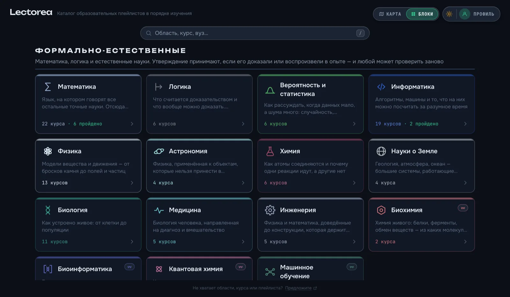
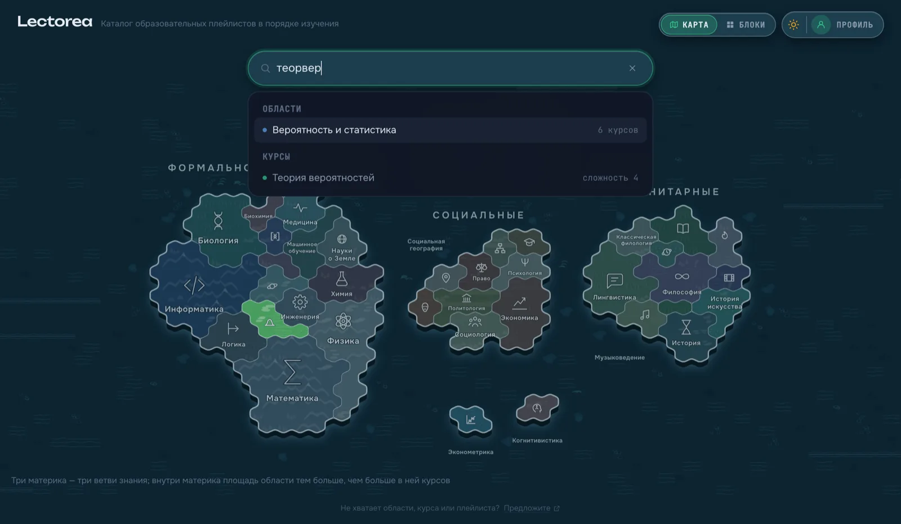
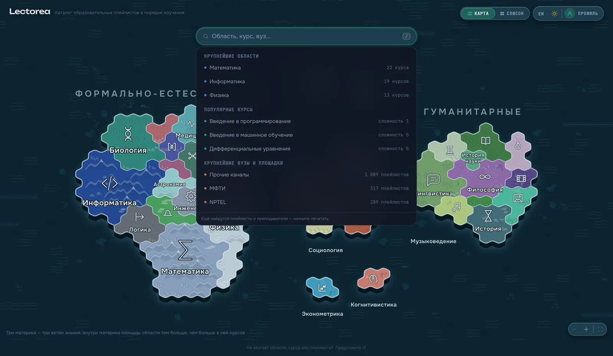
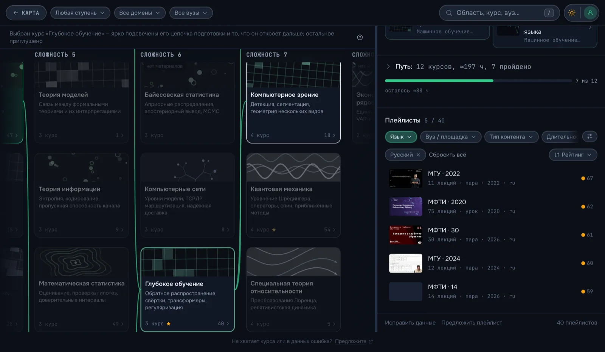

# The interface

[← docs](README.md) · [the live site](https://fivol.github.io/lectorea/)

Three screens, and the profile is the thread running through them.

## The map — `/`

The way in. Three continents — formal and natural, social, humanities — with the
fields of knowledge marked out on them as territories, each sized by how many
courses it holds and carrying an icon, so the empty outskirts are visible as
work still to be done.

It is one drawing, `public/map.svg`: coastlines and territory outlines and
nothing else, with the colours, the lettering and the sea painted by the app, so
the whole map follows the light and dark themes. It is a plan on disk and a view
on screen — the app lays the ground back a little and stands the continents in
the water as slabs with a cliff at the coast, the same projection the tile
collection draws in ([tiles.md](tiles.md)). The ground inside a territory comes
from that collection, and so does the water around them.

Each continent is a climate — the formal one ice and stone, the social one grass
and sand, the humanities wood, water and heather — and each field inside it is a
biome: a range, a glacier, a steppe, a marsh, with an island biome that exists
nowhere on the mainland. One table says which country a field is and, on the
same line, what colour it is painted, so a continent reads as one place and no
two neighbours look alike ([biomes.md](biomes.md)); the grid is read back off the
outlines rather than stored, so a redrawn map keeps its ground.

Pick a territory to enter the columns filtered to it, or search.

The map is moved rather than looked at: two fingers on a trackpad carry it, a
pinch or `⌘`/`Ctrl` and the wheel magnifies about the pointer, and dragging does
what dragging a map does. A press that turns into a drag stops being a press, so
the territory under it is not opened. Three buttons in the corner do the same
for a pointer with no second gesture in it, and the last of them puts the map
back. It goes in four times and no further — that is one continent filling the
window, and past it a reader is looking at two territories and a lot of
hexagons.

The lettering only half follows. Everything written on the map — names, counts,
icons, the halo behind them — takes a share of the magnification rather than all
of it, so four times in the ground is four times bigger and the names not quite
twice. Growing with the ground would make going in pointless: the same map at
the same density, drawn larger. Holding perfectly still is the other mistake —
a continent filling the window, read through eight-pixel labels. A share gets
both: the names shrink against the territories, so fields that had to put their
names out at sea, or go unnamed until pointed at, take them back — and they are
still comfortable to read at the far end.

The size the map comes to rest at is what all of that is measured from, and it
is arrived at from two boxes rather than one. `map.svg` is a rectangle with the
continents in the middle of it and a third of its width in open water round the
outside; fitting the rectangle to the window drew the land at two thirds the
size of the room it had. So the land is what the window is measured against and
the water is what runs off the edges — up to a comfortable width, past which the
land stops growing and the sea around it grows instead, so a large display gets
the map at a readable size rather than a wall map and a name is the same size
there as on a laptop.

The window it is fitted to is not quite the window either. The drawing runs edge
to edge and passes under the header — the sea has to carry on behind the
wordmark, or the header reads as a lid on it rather than something lying on it,
and dragging the map has to slide the land under its own controls. What the map
is *fitted* to is the part nothing is standing on, so the northernmost names
come to rest below the search field even though the water behind it is theirs.
The lettering with no plate under it takes the same halo the map gives its own
names.

On a small screen the map falls back to a grid of blocks carrying the same
icons; on a wide one the switch in the header does the same by hand.

That choice
lasts the visit and no longer: the map is the front door, so every visit opens
on the drawing, and the wordmark leads back to it from anywhere. The way back
from the columns is the other half of that pair — it returns to the view you
left, blocks included, and says which one it is.

## The columns — `/courses`

The catalogue proper. A column is «сложность N» — the length of the longest
chain of prerequisites ending at that course — so reading left to right is
reading how much has to come first, and a line above the columns says exactly
that.

Pointing at a card lights up what it needs and fades the rest; selecting one
also draws the curves along that chain, and only that chain — over 200 cards
they were a web of noise, but over the six or seven of one path they answer what
the columns cannot, which of the cards on the left this one actually needs.
Select a course and the line above changes to say so — half the screen has just
dimmed, and the legend explaining the columns would leave the reason for it
unsaid; the **?** beside it opens the full legend, which also appears by itself
on a first visit.

Cards of one field stay together vertically, so switching on a domain filter
lights a stripe rather than a spray. The columns scroll sideways and say so: the
edges fade where there is more, and stop fading at the ends. Opening the panel
brings the selected card back into view rather than letting it disappear under
it.

Each card carries its one-line description and the stage a person normally meets
that course at — «9 класс», «2 курс», «аспирантура». That is the question people
arrive with, and it is not the same as the column: «Введение в социологию» and
«Школьная алгебра» share a column while one is a first-year university course
and the other is school.

## Filters

Three sit in the header:

- **Ступень** caps the catalogue at a school year or a university one — pick «11
  класс» and everything past it disappears, in every field and in the next
  session too, because it says something about the reader rather than about the
  view.
- **Область** and **Вуз** are per-view and searchable, and both name what is
  selected instead of counting it.

A domain filter shows that field and nothing else — not even a prerequisite from
elsewhere, which as a faded card several columns away read as part of the field
you asked for. Those live in the panel instead.

## Search

The search box matches titles, abbreviations and slang (`теорвер`, `линал`),
because morphology here is a list of forms, not a stemmer.

It opens on focus rather than on the first keystroke, and before anything is
typed it already holds rows.

On the map those are the largest areas, courses and
universities under their own headings: a field that says «Область, курс, вуз…»
is worth more when it shows the three rather than asking to be believed. Beside
the columns it opens on that slice instead — the courses and recordings that
survive the filters, since once a field has been picked, «the biggest area» is
no longer an answer to anything. Typing still reaches the whole catalogue; a
filter says what to look at, not what exists.

On a phone the search is its own screen — back arrow, full-width field, the
whole height for the list — and backing out of it leaves nothing typed behind.
Above the columns what opens it is a search icon: that row is three filters deep
already, and an input wedged into the 160px left between two buttons is a target
you have to aim at, dropping a list read through a letterbox. On the first
screen there is room for the field itself, so the field is what you tap — the
same screen opens, and course names arrive with the width to be read whole
rather than cut at «Дифференциальные уравне…».

## The course panel

Selecting a course opens it; the × in the panel, or a click on empty space, puts
the columns back to full width.

- **Требует знания** and **Даст понимание курсов** are the same relation read in
  either direction, so they use the same card and sit next to each other,
  whichever field the neighbour comes from, with the full chain below the pair.
- **Path** — everything that has to come first, in order, with an hour estimate
  and how much of it you have already marked done. «Export» copies it to the
  clipboard and downloads it as a Markdown checklist with links.

  

- **Playlists** — the concrete recordings of that course, sorted by a bayesian
  rating rather than raw views. Filter by language, provider, lecturer, lecture
  length, captions, year, completeness; hide what you have watched. The language
  filter starts on the language of the interface and stays there even for a
  course that has nothing in it: rather than quietly dropping the filter, the
  list says there is nothing in that language and shows the other languages
  underneath, so «no Russian lectures on this at all» is something you learn
  instead of something you infer. The filters
  sit in one strip that scrolls sideways, ordered by how often they are reached
  for, and the button at its end unfolds the lot; sorting has its own row,
  because at the end of that strip it read as one more filter. The provider and
  lecturer lists are searchable — here and in the header above the columns — and
  every one of them names its rows before anything is typed, most first, so the
  field narrows a list you can already see rather than asking you to guess at a
  spelling. The lecturer filter disappears for a course whose recordings name
  nobody.

  

Marking a course cycles it through *nothing → in progress → done*, which is what
makes "what can I study right now" answerable.

## The profile

A modal, not a page — it opens over whatever you were looking at. Courses and
playlists you have marked, a **Недавние** tab holding the playlists you have
opened (clearable in full or row by row), and settings for language and theme.

Light and dark also have a one-click toggle in the header of both screens — that
choice is about the room you are sitting in, not about your account, and behind
a modal most people put up with the wrong one; «Авто» stays in the settings.

The language sits on the same plate, for a harder reason: someone who cannot
read the interface cannot find the settings that would fix it, and two letters
in the corner are what that person looks for. Russian and English, and like the
theme button it shows where the click leads rather than where you are. Only the
interface is translated — course titles and descriptions stay in the language
the catalogue is written in.

There is no account and no backend: it all lives in `localStorage`. The **Data**
tab exports it as a JSON file and imports one back, either replacing what is
there or merging it — on a conflict the more advanced status wins, and histories
interleave by time. That is the whole sync story, and it works between browsers
without a server.

## What lives in the URL

The domain and provider filters, the selected course and the open playlist — so
a link carries the exact view and the back button behaves.

The stage cap and the display settings do not: they belong to the reader, not to
the view being shared, and stay in `localStorage`. Map or blocks is neither — it
is not what a link points at, and it is not something one visit should decide
for the next, so it lives in memory for the length of the visit.

## Keyboard

| Key | |
|---|---|
| `/` | search |
| `t` | theme |
| `m` | swap map and columns |
| `Esc` | close the top layer |
| `?` | list all of them |
