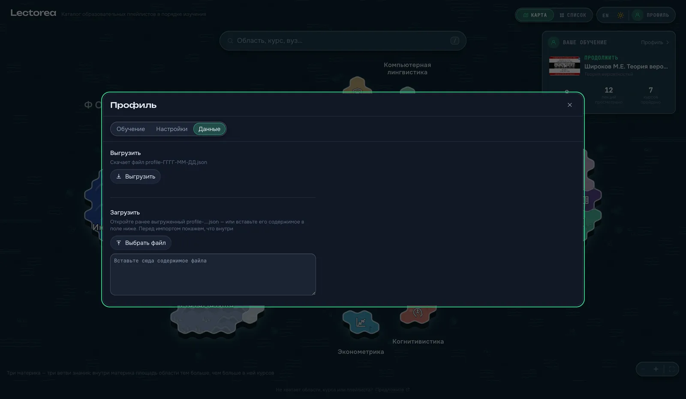

# Roadmap

[← docs](README.md) · [the live site](https://lectorea.org/)

What is being worked towards, why, and what is deliberately not planned. Nothing
here is a promise with a date on it; it is the order things are likely to happen
in, and the reasoning is more useful than the order.

## Where it stands today

The site is static and there is no backend. Everything a reader marks —
lectures, playlists, courses, favourites, the days they studied — lives in one
`localStorage` key, and the **Данные** tab exports it as a JSON file and imports
one back, replacing or merging ([interface.md](interface.md#the-desk)).

That buys a great deal. No account to make, no password to lose, no server that
can go down or read your history, and a fork of this repository is a working site
after one deploy. It costs exactly one thing, and readers hit it immediately:
**the profile is trapped in one browser.** Study on a laptop, open the site on a
phone, and it does not know you. Clear the browser's site data and a year of
marks is gone with no way back.

Everything at the top of this list is about paying that cost down without giving
up what it bought.

## 1. Sync between devices — done

The same profile on a laptop, a phone and a tablet, without either of them being
the master copy. It shipped as **a sync account**: sign in with Google in
**Настройки → Аккаунт**, and the profile lives in a Firestore document under that
identity. How it works, what it costs and how to set the project up is
[sync.md](sync.md).

Half of it already existed, which is why this was the affordable one: the file
import merges rather than overwrites, and its rules were written for exactly
this — on a conflict the more advanced status wins, days union, a lecture
watched on either machine is watched, and histories interleave by time. Merging
two profiles in either order gives the same answer, and merging twice changes
nothing, which is what makes syncing them safe. What the sync added was a
revision counter and one distinction the file import never needed: a union
cannot carry an erasure, so a device that has written nothing since it last
synced takes the cloud copy **wholesale** instead of merging it. Without that,
unticking a lecture on a phone could never reach a laptop.

Three shapes were on the table:

| | How it works | Why not |
|---|---|---|
| **A sync code** | one device shows a short code, the other types it, the profile passes through a relay and is never stored | still needs a service to relay through, and both devices have to be to hand at the same moment — which is not what "my phone knows what I watched" means |
| **A folder you own** | the profile syncs into a file in the reader's own Dropbox / iCloud / WebDAV | no server at all, but every provider is its own integration and its own login flow, and the cheapest of them is still more work than all of Firestore |
| **A sync account** ✅ | sign in with an existing account and the profile lives under that identity | chosen |

The constraint that decided it, and that has not moved: **the site must keep
working with no account at all.** Sync is a thing you turn on, never a wall in
front of the catalogue, and a reader who never signs in must not lose a single
feature — or download a single byte of the code that would have signed them in.
The profile is still `localStorage` first and the identity is still not its
primary key: the cloud copy is a copy.

Two ways in, and neither is a fallback: Google, and a link sent to an email
address — which also solves the case a popup handles worst, since the letter can
be opened on a device other than the one that asked for it. What is left of the
item is Apple sign-in, and what is stopping it is a paid developer account
rather than any part of the design.

## 2. Progress kept off the browser

Sync solves "two devices"; it does not solve "I cleared my cookies". Those are
the same mechanism from the outside and different problems underneath: the
second one needs a copy that survives the device, not a copy on another device.

The account above answers it for anybody who has one — the cloud copy is what
outlives the browser — and leaves it exactly where it was for everybody else.
So what remains is for the readers who will never sign in, and it is small: the
profile knows when it was last exported, and one with three hundred marks and no
backup in six months could say so once. A middle step worth having on its own:
an export that is one press rather than three, and an import that takes a
dropped file anywhere on the page.

## 3. A plan with dates in it

The path already answers "what, in what order, and roughly how many hours"
([interface.md](interface.md#the-course-panel)). It does not answer "by when",
which is the question anybody planning a term actually has. Given hours a week,
the path becomes a schedule; given a date to finish by, it becomes hours a week.
Both are arithmetic over numbers the catalogue already has.

Exported as an `.ics` calendar it stops being a document and becomes something
that turns up in the morning. This is the one item on the list that needs no
server, no account and no new data — only the interface for it.

## 4. Reminders that a run is about to break

The streak is the one number in the profile that can be lost by doing nothing,
which is exactly what makes it work. The site is already an installable PWA, so
the notification permission is available where the reader has installed it;
nothing else is needed. It has to be opt-in, quiet, and never more than one a
day — a study site that nags is a study site people uninstall.

## 5. Search inside the lectures

The catalogue knows which recordings have subtitles. It does not read them.
Fetching and indexing that text would move search from "which course is this"
to "which lecture explains this" — the question people bring to a search box
after they have already found the course. It is the most valuable thing on this
list and the most expensive: transcripts are large, the index would dwarf the
catalogue, and it would have to be built per language.

## 6. More of the catalogue in English

The interface is Russian and English; the catalogue is Russian with English
titles for the courses and a mostly Russian-language set of recordings
([`data/i18n`](../data/i18n)). English-language playlists are already crawled and
already ranked — three quarters of what has been found is in English — so what is
missing is not material but the editorial pass that files it: course texts,
keywords and the search forms that make `linalg` find linear algebra the way
`линал` does.

## 7. Smaller things worth doing

- **Notes.** A line of your own on a course or a lecture, exported with the plan.
  Everything needed for it is already in the profile's shape.
- **A lighter way to fix the data.** Today «Предложить плейлист» opens a GitHub
  issue form, which is a wall for anyone without an account
  ([CONTRIBUTING.md](../CONTRIBUTING.md)).
- **Recordings that are not on YouTube.** University media portals hold courses
  that exist nowhere else. Every one of them is its own crawler, so this waits
  until a specific gap justifies it ([harvest.md](harvest.md)).
- **"What can I start now" — done, as a shelf rather than a screen.** The graph
  knows which courses have every prerequisite behind you, and «Можно начать
  сейчас» on [the desk](interface.md#the-desk) is that list: what is unlocked,
  goals first, ranked by what each one opens up. A screen of its own was
  rejected — the answer is only interesting next to what you are already
  studying, and on its own it would be a second catalogue with a different
  filter.
- **Sharing a path.** A link that carries a plan, so one person can hand another
  a route through a subject.

## Not planned

Saying no to these once is cheaper than reconsidering them every few months.

- **No ads, no paid tier, no "premium" anything.** The catalogue is a list of
  links to free lectures; charging for a view of it would be charging for
  somebody else's work.
- **No account required to read.** Sync landed, and it is a setting: nothing is
  behind it, nothing is withheld without it, and a reader who never signs in
  downloads none of it. That is not a transitional state — it is the shape.
- **No analytics that follow a reader.** The site does count what happens on it
  — which courses are opened, and above all which searches find nothing, since a
  search with no results is a course the catalogue is missing and there is no
  other way to hear about one. What it does not do is follow anybody: no
  account, no identifier of ours, no advertising signals, nothing a reader
  typed except a search term that has been through a filter, and a switch in
  the settings that turns the whole of it off. The rules are written out in
  [analytics.md](analytics.md), and the line they draw is not moving: the
  profile stays in the browser.
- **No comments, ratings or forum.** The rating is computed from what YouTube
  already measures ([rating.md](rating.md)), and a comment section is a
  moderation commitment this project cannot honour.
- **No hosting the videos.** The lectures belong to the universities and channels
  that recorded them, and they stay where they are, with the view counted where
  it should be.
- **No AI-generated courses or summaries in the catalogue.** A model is used in
  the pipeline to *match* a playlist to a course somebody wrote down
  ([pipeline.md](pipeline.md#matching)); nothing a reader sees is invented by
  one.

## Suggesting something

Open an issue — there is a form for "everything else":
[new issue](https://github.com/fivol/lectorea/issues/new/choose). A missing
course, a wrong prerequisite or a better recording is worth more than any item
on this page, and those have their own forms.
